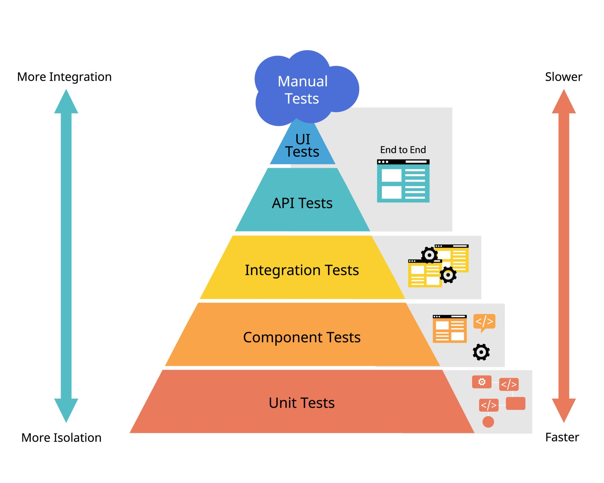
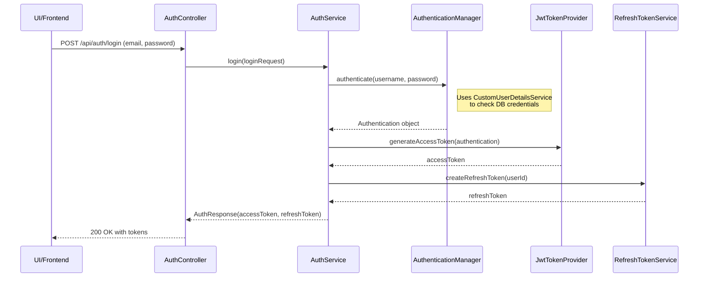
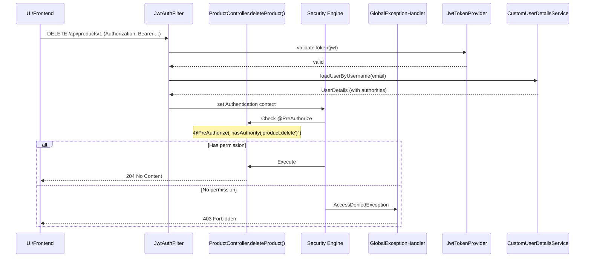

# Testing Strategy for the Application

This document summarizes key questions and answers regarding how to design an effective and sustainable testing strategy for a Spring Boot project.

---

## 1. Overview of the Strategy: The Testing Pyramid

The most effective strategy for a modern application is following the **Testing Pyramid**. This model helps distribute testing effort wisely, ensuring high coverage without slowing down development.

The pyramid has 3 main layers:

### Layer 1: Unit Tests (Foundation — write the most) 🧪

* **Goal**: Test the smallest unit of code (a class or method) in isolation, without DB or other components.
* **Focus**: Service classes (`...ServiceImpl`), where business logic lives.

### Layer 2: Integration Tests (Middle — write moderately) 🧩

* **Goal**: Test interactions between multiple components (Controller → Service → Repository → Database).
* **Focus**: Controllers and major business workflows.

### Layer 3: End-to-End (E2E) Tests (Top — write the least) 🌐

* **Goal**: Test the entire user flow from UI to backend, simulating real user behavior.
* **Focus**: Primary user scenarios.

---

## 2. Testing Scope for Each Package

### a. Should we test Repository and database connection?

**No**, you don’t need to write separate unit tests for Repository interfaces or database connectivity.

* **Repository**: Methods from `JpaRepository` are already heavily tested by Spring — retesting them is unnecessary.

* **Database connectivity**: This is a configuration concern. Integration tests will naturally validate it. If your DB config is wrong, your tests will fail instantly — which is exactly what you want.

* **When should you test Repository?**
  Only when you write custom queries using `@Query`.
  In that case, you write an **Integration Test**, not a unit test.

### b. How to test packages like utils, config, and common?

#### `utils` — ⭐ Must have Unit Tests

* **Why**: Utility classes (e.g., SlugGenerator) contain pure logic. A tiny bug here affects the entire app.
* **Strategy**: Write unit tests covering all input cases (normal text, diacritics, special chars, empty, null).

#### `config` — 🧩 Covered via Integration Tests

* **Why**: Config classes are mostly declarations (`@Bean`, `@Configuration`) and contain no business logic.
* **Strategy**: They are implicitly tested during integration tests.
  If configuration is wrong, the Application Context fails to initialize.

#### `common` — 🧩 Covered via Integration Tests

* **Why**: Classes like `BaseEntity` contain shared fields and annotations, not complex logic.
* **Strategy**: Their behavior (e.g., auto-filling `createdAt`) gets validated through entity-related integration tests.

---

## 3. Strategy Summary

* **Prioritize Unit Tests for Service classes**: They contain business logic — aim for high coverage here.
* **Use Integration Tests to validate core flows**: One integration test per important API ensures end-to-end reliability.
* **Clear separation**:

  * utils → Unit Test
  * config & common → covered by Integration Test
* **Don’t test the framework**: Trust Spring Data JPA. No need to test features it already guarantees.

---

## 4. New Security Configuration Flow

The updated security architecture follows two core principles:
**Stateless Authentication (JWT)** and **Permission-Based Authorization**.

The process is split into two main phases:

1. **Authentication** (when the user logs in)
2. **Authorization** (when the user accesses a protected resource)

---

## 4.1. Authentication Flow

This flow happens when the user submits an email and password to log in.

### Explanation

1. **Client → AuthController**: User submits login credentials.
2. **AuthController → AuthService**: Delegates business logic.
3. **AuthService → AuthenticationManager**: Uses Spring Security to authenticate.
   Internally calls `CustomUserDetailsService` to load user & verify password.
4. **Returns Authentication**: If successful, roles & permissions are included.
5. **Token generation**:

   * `JwtTokenProvider` creates **accessToken**
   * `RefreshTokenService` creates & stores **refreshToken**
6. **AuthService → AuthController**: Returns both tokens.
7. **Controller → Client**: Sends 200 OK with tokens.

---

## 4.2. Authorization Flow

This happens when the user tries to access a protected endpoint.

:::note EEplain

1. Client sends request with JWT.
2. `JwtAuthFilter`:

   * Extracts token
   * Validates it
   * Loads user details with permissions
   * Sets Authentication in `SecurityContextHolder`
3. Spring Security intercepts controller call due to `@PreAuthorize`.
4. Compares required permission (`product:delete`) with user’s authorities.
5. Outcomes:

   * **Match** → Method runs
   * **No match** → `403 Forbidden`

:::
