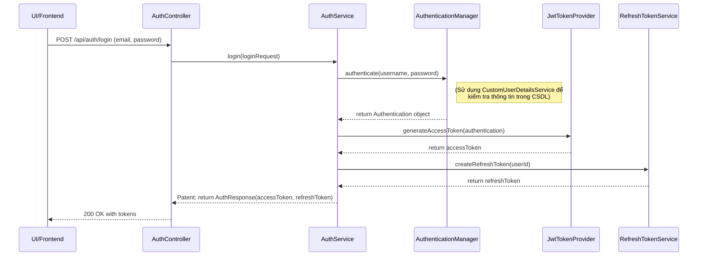
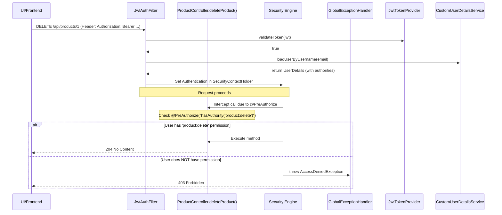

# Chiến lược Kiểm thử cho ứng dụng

Tài liệu này tổng hợp các câu hỏi và câu trả lời liên quan đến việc xây dựng một chiến lược kiểm thử (testing) hiệu quả và bền vững cho dự án Spring Boot.

---

## 1. Tổng quan về Chiến lược: Kim tự tháp Kiểm thử

Chiến lược hiệu quả nhất cho một ứng dụng hiện đại là tuân theo mô hình "Kim tự tháp Kiểm thử" (Testing Pyramid). Mô hình này giúp chúng ta phân bổ nỗ lực một cách hợp lý, đảm bảo độ bao phủ cao mà không làm chậm quá trình phát triển.

Kim tự tháp gồm 3 tầng chính:

### Tầng 1: Unit Tests (Nền tảng - Viết nhiều nhất) 🧪

- Mục tiêu: Kiểm tra một đơn vị code nhỏ nhất (một class, một phương thức) một cách cô lập, không phụ thuộc vào CSDL hay các thành phần khác.
- Trọng tâm: Các lớp Service (...ServiceImpl), nơi chứa logic nghiệp vụ.

### Tầng 2: Integration Tests (Tầng giữa - Viết vừa phải) 🧩

- Mục tiêu: Kiểm tra sự phối hợp và tương tác giữa nhiều thành phần với nhau (ví dụ: Controller → Service → Repository → Database).
- Trọng tâm: Các lớp Controller và các luồng nghiệp vụ quan trọng.

### Tầng 3: End-to-End (E2E) Tests (Tầng đỉnh - Viết ít nhất) 🌐

- Mục tiêu: Kiểm tra toàn bộ luồng ứng dụng từ giao diện người dùng (UI) đến backend, mô phỏng chính xác hành vi của người dùng thật.
- Trọng tâm: Các kịch bản sử dụng chính của người dùng.

---

## 2. Phạm vi Kiểm thử cho Từng Loại Package

### a. Có cần test Repository và kết nối CSDL không?

**Không**, bạn không cần viết Unit Test riêng cho các interface Repository hay việc kết nối CSDL.

- **Repository**: Các phương thức cơ bản của JpaRepository đã được Spring kiểm thử kỹ lưỡng. Việc test lại chúng là không cần thiết.
- **Kết nối CSDL**: Đây là vấn đề về cấu hình. Nó sẽ được kiểm tra một cách tự nhiên trong quá trình Integration Test. Nếu cấu hình sai, các Integration Test sẽ thất bại ngay lập tức, đó chính là cách kiểm tra hiệu quả nhất.
- **Khi nào cần test Repository?** Chỉ khi bạn tự viết một câu lệnh truy vấn phức tạp bằng `@Query`. Khi đó, bạn sẽ viết một Integration Test (không phải Unit Test) để đảm bảo câu lệnh SQL của bạn hoạt động đúng.

### b. Test các package utils, config, và common như thế nào?

`utils` (Tiện ích) - ⭐ Phải có Unit Test

- Lý do: Các lớp tiện ích (ví dụ: SlugGenerator) chứa logic thuần túy và độc lập. Một lỗi nhỏ ở đây có thể ảnh hưởng đến toàn bộ hệ thống.
- Chiến lược: Viết Unit Test để kiểm tra tất cả các trường hợp đầu vào (chuỗi bình thường, chuỗi có dấu, ký tự đặc biệt, chuỗi rỗng, null).

`config` (Cấu hình) - 🧩 Được kiểm thử qua Integration Test

- Lý do: Các lớp cấu hình chủ yếu là code khai báo (@Bean, @Configuration). Chúng không có logic để unit test.
- Chiến lược: Chúng được kiểm thử một cách ngầm định khi bạn chạy các Integration Test. Nếu cấu hình sai, Application Context sẽ không thể khởi tạo và test sẽ thất bại.

`common` (Dùng chung) - 🧩 Được kiểm thử qua Integration Test

- Lý do: Các lớp như BaseEntity chỉ chứa các trường và annotation, không có logic nghiệp vụ.
- Chiến lược: Chức năng của BaseEntity (ví dụ: tự động điền createdAt, createdBy) sẽ được kiểm tra khi bạn viết Integration Test cho các entity kế thừa nó (ví dụ: kiểm tra xem một Brand mới tạo có được điền đúng ngày giờ không).

---

## 3. Tóm tắt Chiến lược

- Tập trung Unit Test vào lớp Service: Đây là nơi chứa logic nghiệp vụ, hãy đảm bảo độ bao phủ cao nhất ở đây.
- Dùng Integration Test để xác thực các luồng chính: Viết Integration Test cho mỗi API endpoint quan trọng để đảm bảo chúng hoạt động từ đầu đến cuối.
- Phân loại rõ ràng: Áp dụng đúng loại test cho đúng loại package (utils dùng Unit Test, config và common được kiểm tra qua Integration Test).
- Không test framework: Tin tưởng vào Spring Data JPA và không viết test cho các chức năng mà nó đã cung cấp sẵn.

---

## 4. Luồng Cấu hình Bảo mật Mới

Kiến trúc bảo mật mới của ứng dụng được xây dựng dựa trên hai nguyên tắc cốt lõi: **Xác thực phi trạng thái (Stateless Authentication)** sử dụng JWT và **Phân quyền dựa trên Quyền hạn (Permission-Based Authorization)**. Luồng hoạt động được chia thành hai giai đoạn chính: **Xác thực** (khi người dùng đăng nhập) và **Phân quyền** (khi người dùng truy cập tài nguyên được bảo vệ).

### 4.1. Luồng Xác thực (Authentication Flow)

Đây là quá trình xảy ra khi người dùng gửi email và mật khẩu để đăng nhập.

#### Diễn giải các bước

1. **Client → AuthController**: Người dùng gửi yêu cầu đăng nhập chứa email và mật khẩu.
2. **AuthController → AuthService**: Controller nhận yêu cầu và gọi đến AuthService để xử lý logic nghiệp vụ.
3. **AuthService → AuthenticationManager**: AuthService sử dụng AuthenticationManager của Spring Security để xác thực thông tin đăng nhập. AuthenticationManager sẽ ngầm gọi CustomUserDetailsService để tải thông tin người dùng từ CSDL và so sánh mật khẩu.
4. **AuthenticationManager → AuthService**: Nếu thành công, AuthenticationManager trả về một đối tượng Authentication chứa đầy đủ thông tin người dùng và các quyền hạn của họ.
5. **Tạo Tokens**: AuthService sử dụng đối tượng Authentication để gọi JwtTokenProvider tạo ra accessToken và gọi RefreshTokenService để tạo và lưu refreshToken vào CSDL.
6. **Trả về Response**: AuthService trả về một AuthResponse chứa cả hai token cho AuthController.
7. **AuthController → Client**: Controller gửi response 200 OK kèm theo hai token về cho client để lưu trữ.

### 4.2. Luồng Phân quyền (Authorization Flow)

Đây là quá trình xảy ra mỗi khi người dùng truy cập một endpoint được bảo vệ.

#### 4.2.1 Diễn giải các bước

1. **Client → JwtAuthFilter**: Client gửi một request đến một endpoint được bảo vệ, đính kèm accessToken trong header Authorization.
2. **JwtAuthFilter**: Bộ lọc chặn mọi request và thực hiện các bước sau:
    - Trích xuất token từ header.
    - Gọi JwtTokenProvider để xác thực token.
    - Nếu token hợp lệ, gọi CustomUserDetailsService để tải thông tin UserDetails (bao gồm tất cả các Permission của người dùng).
    - Tạo một đối tượng Authentication và đặt nó vào SecurityContextHolder.
3. **Spring Security & @PreAuthorize**: Request tiếp tục đi đến Controller. Trước khi thực thi phương thức deleteProduct(), cơ chế bảo mật của Spring (được kích hoạt bởi @EnableMethodSecurity) sẽ chặn lại.
4. **Kiểm tra Quyền hạn**: Đọc annotation @PreAuthorize("hasAuthority('product:delete')") và so sánh quyền hạn yêu cầu (product:delete) với danh sách các quyền hạn có trong đối tượng Authentication đã được JwtAuthFilter thiết lập.
5. **Kết quả**:
    - Nếu khớp: Phương thức Controller được phép thực thi.
    - Nếu không khớp: Spring Security ném ra một AccessDeniedException. Lỗi này được GlobalExceptionHandler bắt lại và trả về response 403 Forbidden.
