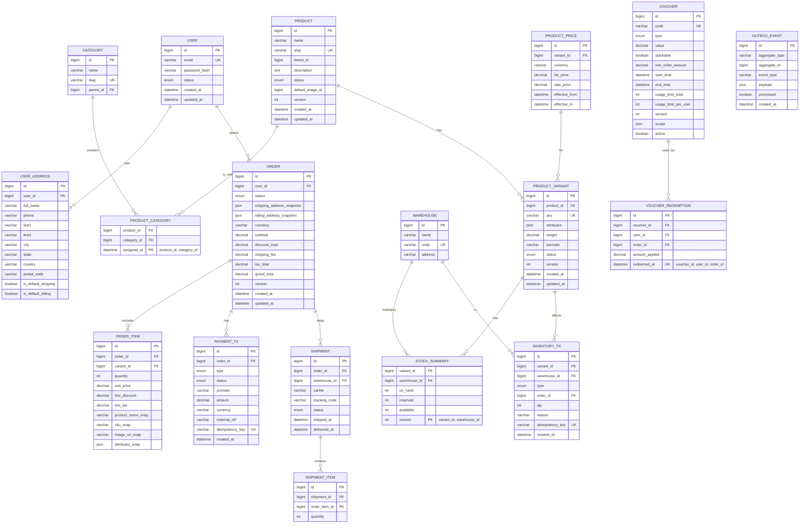

# Future upgrades

```mermaid
erDiagram
  USER ||--o{ USER_ADDRESS : has
  USER {
    bigint id PK
    varchar email UK
    varchar password_hash
    enum status
    datetime created_at
    datetime updated_at
  }
  USER_ADDRESS {
    bigint id PK
    bigint user_id FK
    varchar full_name
    varchar phone
    varchar line1
    varchar line2
    varchar city
    varchar state
    varchar country
    varchar postal_code
    boolean is_default_shipping
    boolean is_default_billing
  }

  CATEGORY ||--o{ PRODUCT_CATEGORY : contains
  PRODUCT ||--o{ PRODUCT_CATEGORY : is_categorized
  PRODUCT ||--o{ PRODUCT_VARIANT : has
  PRODUCT {
    bigint id PK
    varchar name
    varchar slug UK
    bigint brand_id
    text description
    enum status
    bigint default_image_id
    int version
    datetime created_at
    datetime updated_at
  }
  PRODUCT_VARIANT {
    bigint id PK
    bigint product_id FK
    varchar sku UK
    %% color, size...
    json attributes        
    decimal weight
    varchar barcode
    enum status
    %% @Version for optimistic locking
    int version            
    datetime created_at
    datetime updated_at
  }
  CATEGORY {
    bigint id PK
    varchar name
    varchar slug UK
    bigint parent_id FK
  }
  PRODUCT_CATEGORY {
    bigint product_id FK
    bigint category_id FK
    datetime assigned_at
    PK "product_id, category_id"
  }

  PRODUCT_PRICE ||--o{ PRODUCT_VARIANT : for
  PRODUCT_PRICE {
    bigint id PK
    bigint variant_id FK
    varchar currency
    decimal list_price
    decimal sale_price
    datetime effective_from
    datetime effective_to
  }

  WAREHOUSE ||--o{ STOCK_SUMMARY : maintains
  PRODUCT_VARIANT ||--o{ STOCK_SUMMARY : has
  PRODUCT_VARIANT ||--o{ INVENTORY_TX : affects
  WAREHOUSE ||--o{ INVENTORY_TX : in
  INVENTORY_TX {
    bigint id PK
    bigint variant_id FK
    bigint warehouse_id FK
    %% IN, OUT, RESERVE, RELEASE, ADJUST, RETURN
    enum type              
    bigint order_id FK
    int qty
    varchar reason
    varchar idempotency_key UK
    datetime created_at
  }
  STOCK_SUMMARY {
    bigint variant_id FK
    bigint warehouse_id FK
    int on_hand
    int reserved
    int available
    %% @Version, CAS updates
    int version            
    PK "variant_id, warehouse_id"
  }
  WAREHOUSE {
    bigint id PK
    varchar name
    varchar code UK
    varchar address
  }

  "ORDER" ||--o{ ORDER_ITEM : includes
  USER ||--o{ "ORDER" : places
  "ORDER" {
    bigint id PK
    bigint user_id FK
    enum status
    json shipping_address_snapshot
    json billing_address_snapshot
    varchar currency
    decimal subtotal
    decimal discount_total
    decimal shipping_fee
    decimal tax_total
    decimal grand_total
    %% optimistic locking
    int version           
    datetime created_at
    datetime updated_at
  }
  ORDER_ITEM {
    bigint id PK
    bigint order_id FK
    bigint variant_id FK
    int quantity
    decimal unit_price
    decimal line_discount
    decimal line_tax
    %%SNAPSHOT FIELDS
    varchar product_name_snap
    varchar sku_snap
    varchar image_url_snap
    json attributes_snap
  }

  "ORDER" ||--o{ PAYMENT_TX : has
  PAYMENT_TX {
    bigint id PK
    bigint order_id FK
    %% AUTH, CAPTURE, SALE, REFUND
    enum type          
    %% INIT, SUCCESS, FAILED, PENDING
    enum status        
    varchar provider
    decimal amount
    varchar currency
    varchar external_ref
    varchar idempotency_key UK
    datetime created_at
  }

  "ORDER" ||--o{ SHIPMENT : ships
  SHIPMENT ||--o{ SHIPMENT_ITEM : contains
  SHIPMENT {
    bigint id PK
    bigint order_id FK
    bigint warehouse_id FK
    varchar carrier
    varchar tracking_code
    %% READY, SHIPPED, DELIVERED, FAILED
    enum status        
    datetime shipped_at
    datetime delivered_at
  }
  SHIPMENT_ITEM {
    bigint id PK
    bigint shipment_id FK
    bigint order_item_id FK
    int quantity
  }

  VOUCHER ||--o{ VOUCHER_REDEMPTION : used_by
  VOUCHER {
    bigint id PK
    varchar code UK
    %% PERCENT, AMOUNT, FREESHIP
    enum type           
    decimal value
    boolean stackable
    decimal min_order_amount
    datetime start_time
    datetime end_time
    int usage_limit_total
    int usage_limit_per_user
    %% optimistic locking for counters
    int version         
    %% product/category/all
    json scope          
    boolean active
  }
  VOUCHER_REDEMPTION {
    bigint id PK
    bigint voucher_id FK
    bigint user_id FK
    bigint order_id FK
    decimal amount_applied
    datetime redeemed_at
    UK "voucher_id, user_id, order_id"
  }

  OUTBOX_EVENT {
    bigint id PK
    varchar aggregate_type
    bigint aggregate_id
    varchar event_type
    json payload
    boolean processed
    datetime created_at
  }

```