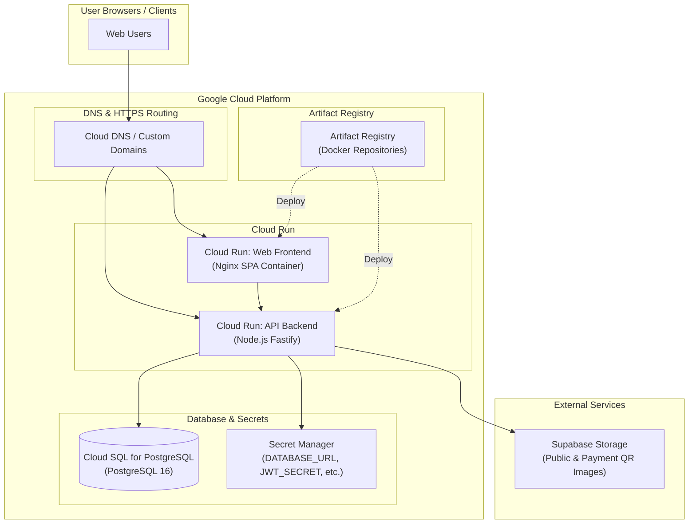
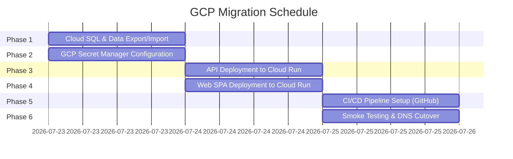

# FF RESTaurent: GCP Migration Plan

This document outlines the end-to-end plan for migrating **FF RESTaurent** from Render to **Google Cloud Platform (GCP)**.

> [!NOTE]
> **This migration was successfully completed on July 25, 2026.** 
> For the historical record of how the migration was actually executed, including post-mortem details and challenges overcome (such as Cloud Build caching and WSL issues), please refer to the [GCP Migration Timeline](./gcp-migration-timeline.md) document. This plan is preserved for historical context.

---

## 1. Executive Summary & Target Architecture

The goal of this migration is to transition the current monorepo stack (`apps/api`, `apps/web`, and `packages/shared`) from Render to a serverless, scalable GCP architecture.

### High-Level Architecture Diagram



### Component Target Mapping

| Component | Current Host (Render) | Target Host (GCP) | Rationale |
| :--- | :--- | :--- | :--- |
| **API Backend** | Render Web Service | **Cloud Run** | Native container support, auto-scaling to zero, low cost, fast startup |
| **Web Frontend** | Render Static Site | **Cloud Run** (or Firebase) | Containerized Nginx handles SPA routes seamlessly |
| **Database** | Render PostgreSQL | **Cloud SQL for PostgreSQL** | Managed Postgres 16 with automated backups, high availability, and SSL security |
| **Secrets & Config** | Render Environment Variables | **GCP Secret Manager** | Secure, versioned secret management integrated directly into Cloud Run |
| **Containers** | Docker Buildpack | **Artifact Registry** | Secure repository for versioned Docker container images |

---

## 2. Prerequisites & Initial GCP Provisioning

Before executing any deployment phases, complete the following initial setup in GCP:

### 1. GCP Project & API Activation

```bash
# Create GCP Project
gcloud projects create ff-restaurent-prod --name="FF RESTaurent Production"
gcloud config set project ff-restaurent-prod

# Enable required Google Cloud APIs
gcloud services enable \
  run.googleapis.com \
  sqladmin.googleapis.com \
  artifactregistry.googleapis.com \
  secretmanager.googleapis.com \
  cloudbuild.googleapis.com \
  iam.googleapis.com
```

### 2. Artifact Registry Setup

```bash
# Create Docker repository in preferred region (e.g. asia-east1)
gcloud artifacts repositories create ff-restaurent \
  --repository-format=docker \
  --location=asia-east1 \
  --description="FF RESTaurent Docker images"
```

### 3. Service Account & IAM Credentials for GitHub Actions CI/CD

```bash
# Create Service Account for deployment
gcloud iam service-accounts create github-deployer \
  --display-name="GitHub Actions Deployment SA"

# Assign required roles
gcloud projects add-iam-policy-binding ff-restaurent-prod \
  --member="serviceAccount:github-deployer@ff-restaurent-prod.iam.gserviceaccount.com" \
  --role="roles/run.admin"

gcloud projects add-iam-policy-binding ff-restaurent-prod \
  --member="serviceAccount:github-deployer@ff-restaurent-prod.iam.gserviceaccount.com" \
  --role="roles/artifactregistry.writer"

gcloud projects add-iam-policy-binding ff-restaurent-prod \
  --member="serviceAccount:github-deployer@ff-restaurent-prod.iam.gserviceaccount.com" \
  --role="roles/secretmanager.secretAccessor"
```

---

## 3. Migration Execution Phases



### Phase 1: Database Provisioning & Data Migration

> [!IMPORTANT]
> **Decouple Database Migrations**: Currently, `apps/api/Dockerfile` executes `prisma migrate deploy` upon container startup. Because Cloud Run dynamically scales multiple container instances concurrently, migrations must be separated into a pre-deployment step to prevent database lock contention.

1. **Provision Cloud SQL Instance**:

   ```bash
   gcloud sql instances create ff-restaurent-db \
     --database-version=POSTGRES_16 \
     --tier=db-f1-micro \
     --region=asia-east1 \
     --storage-size=10GB \
     --storage-auto-increase \
     --backup-start-time=03:00

   gcloud sql databases create ff_restaurent --instance=ff-restaurent-db
   gcloud sql users create ff --instance=ff-restaurent-db --password="<STRONG_PASSWORD>"
   ```

2. **Database Data Export & Import**:
   * Create a snapshot backup of the current database.
   * Export database from Render:

     ```bash
     pg_dump -h <RENDER_DB_HOST> -U <USER> -d ff_restaurent -F c -b -v -f ff_restaurent_production.dump
     ```

   * Import dump into Cloud SQL PostgreSQL instance:

     ```bash
     pg_restore -h <CLOUD_SQL_IP> -U ff -d ff_restaurent -v ff_restaurent_production.dump
     ```

---

### Phase 2: Secret Management Configuration

Store production secrets in **GCP Secret Manager**:

```bash
# Create secrets
gcloud secrets create DATABASE_URL --replication-policy="automatic"
echo -n "postgresql://ff:<STRONG_PASSWORD>@<CLOUD_SQL_IP>:5432/ff_restaurent?schema=public" | \
  gcloud secrets versions add DATABASE_URL --data-file=-

gcloud secrets create JWT_SECRET --replication-policy="automatic"
echo -n "<RANDOM_LONG_PRODUCTION_JWT_SECRET>" | \
  gcloud secrets versions add JWT_SECRET --data-file=-

gcloud secrets create REGISTRATION_INVITE_CODE --replication-policy="automatic"
echo -n "<PRIVATE_PRODUCTION_INVITE_CODE>" | \
  gcloud secrets versions add REGISTRATION_INVITE_CODE --data-file=-

gcloud secrets create CORS_ORIGINS --replication-policy="automatic"
echo -n "https://app.ff-restaurent.com" | \
  gcloud secrets versions add CORS_ORIGINS --data-file=-
```

---

### Phase 3: Backend API Container Deployment

1. **Build & Push API Container**:

   ```bash
   docker build -f apps/api/Dockerfile -t asia-east1-docker.pkg.dev/ff-restaurent-prod/ff-restaurent/api:v1.1.0 .
   docker push asia-east1-docker.pkg.dev/ff-restaurent-prod/ff-restaurent/api:v1.1.0
   ```

2. **Run One-Time Migration & Seed**:
   Execute Prisma migrations against Cloud SQL prior to Cloud Run revision deployment:

   ```bash
   npx prisma migrate deploy --schema apps/api/prisma/schema.prisma
   npm run prisma:cuisines:seed -w @ff-restaurent/api
   npm run prisma:phones:backfill -w @ff-restaurent/api
   npm run prisma:root:bootstrap -w @ff-restaurent/api
   ```

3. **Deploy API to Cloud Run**:

   ```bash
   gcloud run deploy ff-restaurent-api \
     --image=asia-east1-docker.pkg.dev/ff-restaurent-prod/ff-restaurent/api:v1.1.0 \
     --region=asia-east1 \
     --platform=managed \
     --port=4000 \
     --min-instances=0 \
     --max-instances=10 \
     --allow-unauthenticated \
     --set-secrets="DATABASE_URL=DATABASE_URL:latest,JWT_SECRET=JWT_SECRET:latest,REGISTRATION_INVITE_CODE=REGISTRATION_INVITE_CODE:latest,CORS_ORIGINS=CORS_ORIGINS:latest" \
     --set-env-vars="NODE_ENV=production,SUPABASE_URL=https://your-project.supabase.co,SUPABASE_SERVICE_ROLE_KEY=<KEY>,SUPABASE_PUBLIC_BUCKET=ff-public-images,SUPABASE_QR_BUCKET=ff-payment-qr"
   ```

---

### Phase 4: Web SPA Frontend Deployment

> [!NOTE]
> `VITE_API_URL` is compiled into static assets at build time. Obtain the deployed API Cloud Run URL (e.g. `https://ff-restaurent-api-xyz.a.run.app`) before building the Web container image.

1. **Build & Push Web Container**:

   ```bash
   docker build -f apps/web/Dockerfile \
     --build-arg VITE_API_URL=https://ff-restaurent-api-xyz.a.run.app \
     -t asia-east1-docker.pkg.dev/ff-restaurent-prod/ff-restaurent/web:v1.1.0 .
   
   docker push asia-east1-docker.pkg.dev/ff-restaurent-prod/ff-restaurent/web:v1.1.0
   ```

2. **Deploy Web SPA to Cloud Run**:

   ```bash
   gcloud run deploy ff-restaurent-web \
     --image=asia-east1-docker.pkg.dev/ff-restaurent-prod/ff-restaurent/web:v1.1.0 \
     --region=asia-east1 \
     --platform=managed \
     --port=80 \
     --min-instances=0 \
     --max-instances=10 \
     --allow-unauthenticated
   ```

---

### Phase 5: CI/CD Automation (GitHub Actions)

Add GCP deployment step in `.github/workflows/deploy-gcp.yml`:

```yaml
name: Deploy to Google Cloud Run

on:
  push:
    branches:
      - main

jobs:
  deploy:
    runs-on: ubuntu-latest
    steps:
      - name: Checkout Code
        uses: actions/checkout@v4

      - name: Authenticate to Google Cloud
        uses: google-github-actions/auth@v2
        with:
          credentials_json: ${{ secrets.GCP_SA_KEY }}

      - name: Set up Cloud SDK
        uses: google-github-actions/setup-gcloud@v2

      - name: Configure Docker for Artifact Registry
        run: gcloud auth configure-docker asia-east1-docker.pkg.dev

      - name: Build & Push API Image
        run: |
          docker build -f apps/api/Dockerfile -t asia-east1-docker.pkg.dev/${{ secrets.GCP_PROJECT }}/ff-restaurent/api:${{ github.sha }} .
          docker push asia-east1-docker.pkg.dev/${{ secrets.GCP_PROJECT }}/ff-restaurent/api:${{ github.sha }}

      - name: Deploy API to Cloud Run
        run: |
          gcloud run deploy ff-restaurent-api \
            --image=asia-east1-docker.pkg.dev/${{ secrets.GCP_PROJECT }}/ff-restaurent/api:${{ github.sha }} \
            --region=asia-east1

      - name: Build & Push Web Image
        run: |
          docker build -f apps/web/Dockerfile --build-arg VITE_API_URL=${{ secrets.PROD_API_URL }} -t asia-east1-docker.pkg.dev/${{ secrets.GCP_PROJECT }}/ff-restaurent/web:${{ github.sha }} .
          docker push asia-east1-docker.pkg.dev/${{ secrets.GCP_PROJECT }}/ff-restaurent/web:${{ github.sha }}

      - name: Deploy Web to Cloud Run
        run: |
          gcloud run deploy ff-restaurent-web \
            --image=asia-east1-docker.pkg.dev/${{ secrets.GCP_PROJECT }}/ff-restaurent/web:${{ github.sha }} \
            --region=asia-east1
```

---

### Phase 6: Post-Deployment Smoke Testing & Cutover

Before switching DNS traffic, complete this verification checklist based on the [Deployment Guide](./deployment-guide.md):

* [ ] **Health Endpoint**: `curl https://<CLOUD_RUN_API_URL>/health` returns `200 OK`.
* [ ] **Authentication**: User login and registration work cleanly over HTTPS.
* [ ] **Database Connectivity**: Bill lists, restaurants, and user roles load properly.
* [ ] **CORS Settings**: Frontend can communicate with backend API without CORS errors in browser console.
* [ ] **Image Uploads**: Payment QR code and profile picture uploads succeed via Supabase Storage.
* [ ] **Custom Domain Mapping**: Map custom domains (`app.ff-restaurent.com` and `api.ff-restaurent.com`) via Cloud Run Domain Mappings.
* [ ] **DNS Cutover**: Update A / CNAME records in DNS registrar.

---

## 4. Rollback & Contingency Plan

If critical issues arise post-cutover:

1. **DNS Reversion**: Switch DNS A/CNAME records back to Render endpoints.
2. **Traffic Shifting**: Roll back Cloud Run traffic to the previous known stable revision:

   ```bash
   gcloud run services update-traffic ff-restaurent-api --to-revisions=PREVIOUS_REVISION_NAME=100
   ```

3. **Database Backup Restoration**: If database schema changes occurred, restore pre-migration database snapshot.

---

## 5. Cost Estimation Summary

| GCP Service | Specification | Estimated Monthly Cost |
| :--- | :--- | :--- |
| **Cloud Run (API & Web)** | CPU: 1 vCPU, RAM: 512MB, Auto-scale 0-10 instances | $0.00 – $5.00 (within GCP free tier allowance for light/medium traffic) |
| **Cloud SQL (PostgreSQL)** | `db-f1-micro` (Shared CPU, 0.6 GB RAM, 10 GB Storage) | ~$9.00 – $12.00 / month |
| **Artifact Registry** | Docker images (< 5 GB storage) | ~$0.10 / month |
| **Secret Manager** | < 10 secrets | $0.00 |
| **Total Estimated Cost** | Low traffic production deployment | **~$10.00 - $15.00 / month** |
