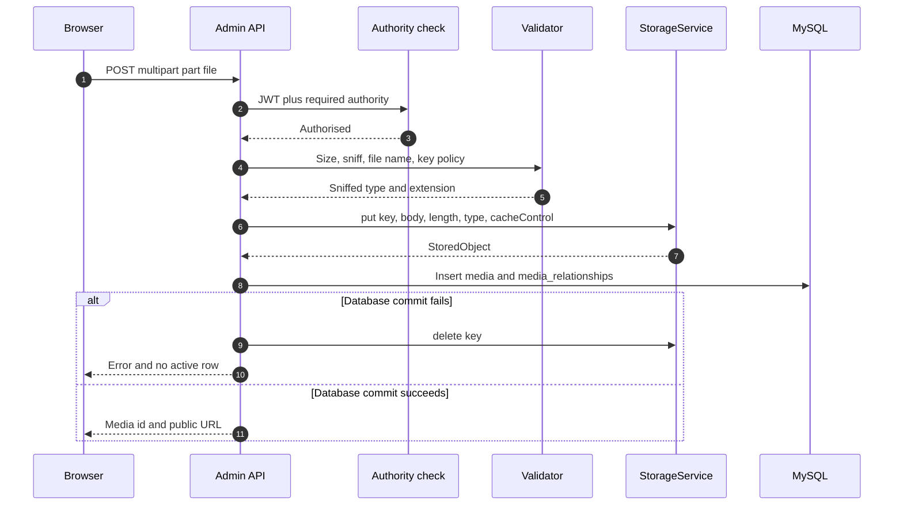

# ADR-0001: Cloudflare R2 object storage for media

## Status

Accepted on 2026-09-30 by the Product Owner (GitLab `laptech/laptech-api#9`).

`laptech-api` !15 (`780a316`) implemented this record and removed Cloudinary. `STORAGE_PROVIDER` is required (`r2`, `minio`, or `local`). There is no Cloudinary fallback. `local` does not persist media rows. Detach and soft-delete do not delete the stored object. The Cloudinary row migration was not part of that merge. Run it only when production rows with `provider = cloudinary` exist. The rollout table later in this record is the original plan; the cutover and the Cloudinary removal shipped together.

The same acceptance replaces the shared-bucket assumption below: object bytes go in a dedicated R2 bucket named `laptech-store-media`. Laptech does not use the LinguFlow bucket. The `laptech/` key prefix stays, so the key policy in this record is unchanged. The Product Owner creates that bucket and applies CORS. On 2026-09-30 the Product Owner set `R2_PUBLIC_BASE_URL` in the git-ignored `laptech-api/.env` to this bucket's `r2.dev` public URL. That host is not copied into this record. It is the dev public base, not a production custom domain. Image transformations stay deferred until a custom domain exists.

## Date

2026-09-29

## Deciders

- Product Owner. Acceptance is the approval on `laptech/laptech-api#9`.
- Catalog maintainers for `laptech-catalog` (`com.sunfly.laptechapi.catalog`).
- Storefront maintainers for the product payload and the Next.js image host allowlist.

## Context

Product media is uploaded through Cloudinary. `CloudinaryService` exposes `uploadOptimized(MultipartFile, folder, publicIdPrefix)`, `destroy(publicId, options)`, and `destroyMultiple(publicIds)`, implemented by `CloudinaryServiceImpl` and `CloudinaryConfig`. `CloudinaryUploadResult` carries the upload response.

`ProductMediaServiceImpl.uploadAndAttachToProduct` uploads into the folder `laptech/products/{productId}`, then inserts `media` (`provider = cloudinary`, public id, secure URL, file name, content type, size, JSON `metadata`) and `media_relationships` (`entity_type = PRODUCT`, product id, media, `media_usage`, position). `deleteMedia` calls Cloudinary `destroy` and then soft-deletes the row.

`media` stores `provider` (50), `public_id` (512), `url` (1024), `file_name`, `content_type`, `size_bytes`, `metadata` JSON, and `deleted_at`. `media_relationships` stores `entity_type`, `entity_id`, `media_id`, `media_usage`, and `position`. Usage values are `PRIMARY`, `GALLERY`, `THUMBNAIL`, `ICON`, `BANNER`, and `SPECIFIC`. `Product` holds `List<MediaRelationship> images`.

| Method | Path | Authority |
| --- | --- | --- |
| GET | `/api/products/{productId}/media` | Public |
| POST | `/api/admin/products/{productId}/media/upload` | `product:media:create` |
| POST | `/api/admin/products/{productId}/media/attach` | `product:media:update` |
| GET | `/api/admin/products/{productId}/media` | Existing admin read rule |
| DELETE | `/api/admin/products/{productId}/media/{mediaId}` | `product:media:delete` |
| DELETE | `/api/admin/media/{mediaId}` | `media:delete` |

The upload part name is `file`.

BACKLOG #7: `ProductResponseDTO` exposes only `id`, `name`, `slug`, `sku`, `stockQuantity`, `price`, `description`, and `originalPrice`. `ProductList`, `ProductCard`, `CartDrawer`, and `ProductDetail` therefore have no image URL to render. The client `Product` type already declares optional `image?: string` and `images?: string[]`. `next.config.ts` allows only `your-image-cdn.com` and `localhost`. `CartItem.image` is snapshotted at add-to-cart, so the list payload must carry the thumbnail. The chosen fix is option 1: embed image fields on the product payload.

Object bytes belong in the dedicated bucket `laptech-store-media`, not in any LinguFlow bucket. Laptech owns that bucket's settings. The Product Owner creates it and applies CORS; this record does not call the Cloudflare API. Deployment already has R2 credential variables; this record lists names only. `R2_BUCKET_NAME` is set to `laptech-store-media` in the git-ignored `.env` when `STORAGE_PROVIDER` is `r2`.

## Decision drivers

| Driver | Implication |
| --- | --- |
| BACKLOG #7 blocks every storefront image | List and detail payloads carry image URLs |
| Cloudinary is being retired | New bytes go to R2; rows move; Cloudinary code is removed after that |
| The bucket is dedicated to Laptech | Bucket name `laptech-store-media`. Keys still stay under `laptech/` |
| One new library is approved | `software.amazon.awssdk:s3` is the only new dependency |
| WSL and CI must run offline | MinIO via Docker Compose supplies the S3 API |
| Metadata already lives in MySQL | `media` and `media_relationships` stay the system of record |
| Browsers must not hold storage credentials | The API proxies uploads for the MVP |

## Decision

Use Cloudflare R2 for media bytes, through the AWS SDK for Java v2 S3 client. Keep metadata on the existing MySQL media tables. Proxy uploads through `laptech-catalog`. Public reads use the `r2.dev` base in `R2_PUBLIC_BASE_URL` for dev. A production custom domain comes later.

### Approved decisions

- The only new dependency is `software.amazon.awssdk:s3`.
- Offline dev and integration tests use a MinIO container.
- MVP uploads are proxied by the API. Direct browser upload is a later decision.
- Dev public URLs use the `r2.dev` host stored in `R2_PUBLIC_BASE_URL`. A production custom domain follows later.
- `ProductResponseDTO` gains `thumbnailUrl` and `images`.
- Cloudinary is removed after the data migration, not before it.
- Media metadata stays on MySQL. MongoDB GridFS is rejected under Alternatives.

### Bucket layout

Bucket name: `laptech-store-media`. Laptech may read and write only keys under `laptech/`.

```text
laptech-store-media/
└── laptech/
    ├── products/
    │   └── {productId}/
    │       └── {uuid}.{ext}
    ├── banners/
    │   └── {bannerId}/
    │       └── {uuid}.{ext}
    ├── avatars/
    │   └── {userId}/
    │       └── {uuid}.{ext}
    └── reviews/
        └── {reviewId}/
            └── {uuid}.{ext}
```

`StorageService` refuses any key outside the configured prefix (default `laptech/`). The second segment must be `products`, `banners`, `avatars`, or `reviews`. Laptech never lists the bucket and never deletes by bucket or by bare prefix. Lifecycle, CORS, public access, and bucket policy are unchanged by this work; each of those needs a separate Product Owner approval. The interface has no bucket-admin method.

### Key naming

| Area | Key |
| --- | --- |
| Products | `laptech/products/{productId}/{uuid}.{ext}` |
| Banners | `laptech/banners/{bannerId}/{uuid}.{ext}` |
| Avatars | `laptech/avatars/{userId}/{uuid}.{ext}` |
| Reviews | `laptech/reviews/{reviewId}/{uuid}.{ext}` |

- `{uuid}` is a random UUIDv4. ULID is not used. The id is not a content hash, so identical bytes may be stored twice.
- `{ext}` comes only from the sniffed type: `jpg`, `png`, `webp`, or `avif`. The client file name is not an input.
- The original name is stored only in `media.file_name` after sanitising.
- Keys are immutable. Replace means a new key, repoint the row, then delete the old object. The same key is never overwritten.
- The id segment is the existing aggregate id. Allowed characters are letters, digits, underscore, and hyphen.
- `public_id` holds at most 512 characters and `url` at most 1024. The builder rejects a key that would overflow either column once the public base URL is prepended.

### Proxied upload flow

The browser talks only to the Laptech API. The API talks to R2.



Validate fully before any network write. `put` the object, then insert `media` and `media_relationships` in one database transaction. If that transaction does not commit, `delete` the new key. If the compensating delete fails, log the key and leave the object for the orphan sweeper. Never log credentials.

`POST .../media/attach` does not upload. It rejects a row whose provider is unknown or whose key fails the prefix policy.

Delete order changes. Cloudinary today destroys the remote object and then soft-deletes, so a crash can leave a live row with a dead URL. The new order commits `deleted_at` first, then deletes the object. The row leaves public responses as soon as it is soft-deleted. A failed object delete is logged for the sweeper. The sweeper does not run as part of the request, and it does not delete outside `laptech/`.

### Validation rules

Allowed types are `image/jpeg`, `image/png`, `image/webp`, and `image/avif`. Compare the type with parameters stripped. Reject a missing declared type, and reject when the declared type disagrees with the sniff. Do not coerce one allowed type into another. Persist the sniffed type.

| Format | Signature |
| --- | --- |
| JPEG | `FF D8 FF` |
| PNG | `89 50 4E 47 0D 0A 1A 0A` |
| WebP | `RIFF` at offset 0 and `WEBP` at offset 8. The four size bytes in between are ignored. |
| AVIF | ISO-BMFF `ftyp` box whose major brand or a compatible brand is `avif` or `avis`. Other brands, including `heic`, are rejected. |

Read a 64-byte header before accepting the object. SVG is rejected, including `image/svg+xml` and SVG bytes presented under another declared type, because SVG is a script and XSS vector when a browser opens the public URL. GIF is rejected, including `image/gif` and `GIF87a` or `GIF89a` bytes. Animated GIF is outside the approved still-image set and is not a catalog format for this MVP.

The proposed ceiling is 5 MiB (5242880 bytes) per image, via `STORAGE_MAX_UPLOAD_BYTES`. Set `spring.servlet.multipart.max-file-size` and `spring.servlet.multipart.max-request-size` from that same value. The service still checks the byte count.

Sanitise `media.file_name` only: strip both slash directions to the base name, drop control characters including NUL, normalise to NFC, drop empty segments and `.` or `..`, cap at 255 characters, and store `upload` if nothing remains. The sanitised name never enters the object key.

### Storage abstraction

`StorageService` sits in the application layer of `laptech-catalog`.

```java
public interface StorageService {
    StoredObject put(String key, InputStream body, long contentLength,
                     String contentType, String cacheControl);
    void delete(String key);
    String publicUrl(String key);
    boolean exists(String key);
}

public record StoredObject(String key, String publicUrl,
                           String contentType, long sizeBytes) {}
```

There is no list method and no prefix-delete method. Every method runs the key policy before network or disk I/O. `delete` takes one full object key and rejects a bare prefix such as `laptech/` or `laptech/products/`.

`publicUrl` appends the guarded key to the configured public base URL. The base URL already identifies the bucket, so the bucket name is not inserted again.

| `STORAGE_PROVIDER` | Bean | Client |
| --- | --- | --- |
| `r2` | `R2StorageService` | AWS SDK v2 `S3Client`, endpoint override, path-style as needed, region `auto` |
| `minio` | MinIO implementation | Same SDK, local endpoint, path-style, region `us-east-1` |
| `local` | Filesystem implementation | JVM temp directory, unit tests only |

Spring maps environment variable `STORAGE_PROVIDER` to property `storage.provider`. `@ConditionalOnProperty` uses `havingValue` `r2`, `minio`, or `local`, so exactly one bean is active. An unknown value fails startup. When the variable is absent, no `StorageService` bean is created and Cloudinary remains the uploader (phase 1).

The R2 client uses a static provider from `R2_ACCESS_KEY_ID` and `R2_SECRET_ACCESS_KEY`, not the default AWS credential chain. MinIO reads `MINIO_ACCESS_KEY` and `MINIO_SECRET_KEY` the same way. Request checksum calculation and response checksum validation are `WHEN_REQUIRED`, so the SDK does not send flexible checksum headers that R2 rejects. Path-style is enabled for MinIO and for the R2 account S3 endpoint.

Persisted `media.provider` is `r2` or `minio`. The `local` implementation does not write deployed rows. `media.public_id` stores the object key. `media.url` stores the public URL. `media.content_type` stores the sniffed type. `media.size_bytes` stores the length.

`CloudinaryService`, `CloudinaryServiceImpl`, `CloudinaryConfig`, and `CloudinaryUploadResult` are deleted in the implementation ticket after migration (phase 5), with the Cloudinary dependency and its configuration.

### Image variants and thumbnails

| Option | Assessment |
| --- | --- |
| (a) Thumbnail at upload with `java.awt.ImageIO` | No new dependency. ImageIO reads and writes JPEG and PNG only. WebP and AVIF need plugins. A generated file would be re-encoded as JPEG. |
| (b) Cloudflare Image Resizing on a custom domain | Fits later. Unavailable on an `r2.dev` host. No application dependency. |
| (c) CSS and `next/image` on the client | Available now. The browser downloads the original. |

MVP decision: store the original only, with no variant objects. When ImageIO can read JPEG or PNG header dimensions, write `width` and `height` into `media.metadata`. A decode miss does not fail the upload, so WebP and AVIF simply omit dimensions. `thumbnailUrl` is that same original URL (selection rules below).

A follow-up ADR decides variants after the custom domain exists, using Cloudflare transformations and no new dependency. Server-side WebP or AVIF thumbnails would need a new library such as TwelveMonkeys ImageIO plugins. That dependency stays out of scope. This epic stores originals only.

### Cache headers

`put` sets `Cache-Control: public, max-age=31536000, immutable` and `Content-Type` from the sniffed type. UUID keys do not change bytes, so no purge is required. A replacement is a new URL. The `r2.dev` host is rate-limited and is not the production edge. The custom domain is what enables Cloudflare cache. This work does not change zone cache rules.

### CORS

CORS is a manual dashboard step for the Product Owner or the bucket owner. This work does not apply it.

Proxied uploads mean the browser never sends `PUT` to R2. A plain `img` load needs no CORS. CORS matters when the storefront uses `fetch` or canvas. The Product Owner applies the following rule on `laptech-store-media`. This work does not call Cloudflare. Methods stay `GET` and `HEAD`.

```json
[
  {
    "AllowedOrigins": [
      "https://<storefront-origin>",
      "http://localhost:3000"
    ],
    "AllowedMethods": ["GET", "HEAD"],
    "AllowedHeaders": ["Range", "If-None-Match"],
    "ExposeHeaders": ["ETag", "Content-Length", "Content-Type"],
    "MaxAgeSeconds": 3600
  }
]
```

### Configuration

Names only. No values, account ids, or secrets appear here. `.env` stays git-ignored and values are never committed. MinIO variables are local-only credentials and are still secret. The R2 access key is scoped to the dedicated bucket `laptech-store-media`. It is not a key for any LinguFlow bucket.

| Name | Purpose | Required when | Sensitive |
| --- | --- | --- | --- |
| `R2_ACCOUNT_ID` | Existing. Account id for the R2 client. | `STORAGE_PROVIDER` is `r2` | No |
| `R2_ACCESS_KEY_ID` | Existing. Access key id. Static provider only. | `STORAGE_PROVIDER` is `r2` | Yes |
| `R2_SECRET_ACCESS_KEY` | Existing. Secret key. Never logged. | `STORAGE_PROVIDER` is `r2` | Yes |
| `R2_BUCKET_NAME` | Existing. Dedicated bucket. Value in `.env` is the name `laptech-store-media`, not a secret. | `STORAGE_PROVIDER` is `r2` | No |
| `R2_ENDPOINT_URL` | Existing. S3 API endpoint. Not the public URL. | `STORAGE_PROVIDER` is `r2` | No |
| `STORAGE_PROVIDER` | New. `r2`, `minio`, or `local`. | The new storage path is on | No |
| `STORAGE_KEY_PREFIX` | New. Default `laptech`, non-empty, no slash or `..`. | `StorageService` is active | No |
| `R2_PUBLIC_BASE_URL` | New. Dev public base. Set in `.env` to the bucket's `r2.dev` URL. The host is not written in this record. A production custom domain is later. | `STORAGE_PROVIDER` is `r2` | No |
| `STORAGE_MAX_UPLOAD_BYTES` | New. Accepted value 5242880. | Uploads are enabled | No |
| `MINIO_ENDPOINT_URL` | New. Local S3 endpoint. | `STORAGE_PROVIDER` is `minio` | No |
| `MINIO_ACCESS_KEY` | New. Local access key. | `STORAGE_PROVIDER` is `minio` | Yes |
| `MINIO_SECRET_KEY` | New. Local secret. | `STORAGE_PROVIDER` is `minio` | Yes |
| `MINIO_BUCKET_NAME` | New. Local bucket, never `laptech-store-media`. | `STORAGE_PROVIDER` is `minio` | No |
| `MINIO_PUBLIC_BASE_URL` | New. Local public base, with a bucket segment if MinIO serves path-style URLs. | `STORAGE_PROVIDER` is `minio` | No |

The MinIO bean refuses to start unless `MINIO_ENDPOINT_URL` is localhost or the Compose service name, so the `minio` profile cannot be aimed at R2. Uploads use `R2_ENDPOINT_URL`. Browsers use `R2_PUBLIC_BASE_URL`.

### Data migration of Cloudinary rows

Current rows have `provider = cloudinary`, a Cloudinary `public_id`, and a secure `url`. The job is gated on the `media-migration` profile and is not an HTTP route.

1. Inventory with `SELECT id, url FROM media WHERE provider = 'cloudinary' AND deleted_at IS NULL`.
2. Resolve `productId` from `media_relationships` where `entity_type = PRODUCT`, lowest `position`, then lowest `entity_id`. If none exists, log the media id and skip. Do not invent an id and do not write outside `laptech/products/`.
3. Download, sniff, and validate with the upload rules, then `put` `laptech/products/{productId}/{uuid}.{ext}`.
4. In one database transaction, insert the audit row and update the same `media` row: `provider` to `r2`, `public_id` to the key, `url` to the new public URL, plus `content_type` and `size_bytes`. Relationships keep `media_id`.
5. Commit per row. Selection is `provider = cloudinary`, so a finished row is not processed again (idempotent and resumable).
6. Leave the Cloudinary asset in place until a person has checked the new URL. This job never calls Cloudinary destroy.
7. If the database transaction fails, compensating-delete the new object. The audit insert rolls back with the media update.

The audit table is created via the project's migration tool:

```text
media_migration_audit
  media_id
  old_provider
  old_public_id
  old_url
  migrated_at
```

Rollback copies `old_provider`, `old_public_id`, and `old_url` back onto `media`. Logs record the media id and the new key, not secrets or query strings. Zero production rows make the job a successful no-op.

### How this fixes BACKLOG #7

`ProductResponseDTO` gains:

- `thumbnailUrl` (`String`, nullable): URL of the `PRIMARY` relationship, else the first `GALLERY` by `position`, else null. `THUMBNAIL`, `ICON`, `BANNER`, and `SPECIFIC` do not fill this field.
- `images`, ordered by `position`, each with `mediaId`, `url`, `usage`, and `position`.

`GET /api/products` includes `thumbnailUrl` and at most five `images` on every element. The cap is applied after ordering. `thumbnailUrl` is chosen from the full set first, so a later `PRIMARY` is not lost. `GET /api/products/slug/{slug}` includes `thumbnailUrl` and every image. The HTTP body stays in the current `ResponseEnvelope`. Examples below are the `data` object only. The host is a placeholder.

One element of `GET /api/products`:

```json
{
  "id": 42,
  "name": "Example laptop",
  "slug": "example-laptop",
  "sku": "LT-42",
  "stockQuantity": 7,
  "price": 1299.00,
  "description": "Example product",
  "originalPrice": 1499.00,
  "thumbnailUrl": "https://pub-example.r2.dev/laptech/products/42/0b6f5c1e-8d4a-4f3e-9a52-7c1d2e3f4a5b.webp",
  "images": [
    {
      "mediaId": 1001,
      "url": "https://pub-example.r2.dev/laptech/products/42/0b6f5c1e-8d4a-4f3e-9a52-7c1d2e3f4a5b.webp",
      "usage": "PRIMARY",
      "position": 0
    }
  ]
}
```

`data` for `GET /api/products/slug/{slug}`:

```json
{
  "id": 42,
  "name": "Example laptop",
  "slug": "example-laptop",
  "sku": "LT-42",
  "stockQuantity": 7,
  "price": 1299.00,
  "description": "Example product",
  "originalPrice": 1499.00,
  "thumbnailUrl": "https://pub-example.r2.dev/laptech/products/42/0b6f5c1e-8d4a-4f3e-9a52-7c1d2e3f4a5b.webp",
  "images": [
    {
      "mediaId": 1001,
      "url": "https://pub-example.r2.dev/laptech/products/42/0b6f5c1e-8d4a-4f3e-9a52-7c1d2e3f4a5b.webp",
      "usage": "PRIMARY",
      "position": 0
    },
    {
      "mediaId": 1002,
      "url": "https://pub-example.r2.dev/laptech/products/42/1c2d3e4f-5a6b-4c7d-8e9f-0a1b2c3d4e5f.webp",
      "usage": "GALLERY",
      "position": 1
    }
  ]
}
```

Load media for a page with one query, then group in memory. Skip the query when the page has no ids.

```sql
SELECT mr.entity_id, mr.media_id, mr.media_usage, mr.position, m.url
FROM media_relationships mr
JOIN media m ON m.id = mr.media_id
WHERE mr.entity_type = 'PRODUCT'
  AND m.deleted_at IS NULL
  AND mr.entity_id IN (:ids)
ORDER BY mr.entity_id, mr.position, mr.media_id;
```

Add the R2 public host to the `next.config.ts` image allowlist, taken from the host of `R2_PUBLIC_BASE_URL`. Keep `your-image-cdn.com` and `localhost`. The placeholder host in this record is `pub-example.r2.dev`. Do not commit a real account host.

The client already has `image?: string` and `images?: string[]`. Map `thumbnailUrl` onto `image`, and map each element URL onto `images`. `CartItem.image` still copies `image` at add-to-cart. `ProductList`, `ProductCard`, `CartDrawer`, and `ProductDetail` can then render that URL. `GET /api/products/{productId}/media` remains for other callers and, after migration, returns the same R2 URLs.

## Consequences

| Effect | Follows from |
| --- | --- |
| Positive. No egress fee on the hot path | R2 does not bill egress the way a typical S3 store does |
| Positive. S3 API portability | One client talks to R2 and to MinIO |
| Positive. Long cache, no purge workflow | Immutable UUID keys match `max-age=31536000, immutable` |
| Positive. One metadata database | MySQL `media` stays authoritative |
| Positive. Storefront can show images | BACKLOG #7 gets `thumbnailUrl` and `images` on the payload |
| Positive. Small dependency change | Only `software.amazon.awssdk:s3` is added |
| Negative. `r2.dev` is rate-limited | That host is for dev, not the production edge |
| Negative. 5 MiB ceiling | Larger files need a later change to `STORAGE_MAX_UPLOAD_BYTES` |
| Positive. Dedicated bucket | `laptech-store-media` holds Laptech objects only. The `laptech/` prefix is a second guard |
| Negative. Proxy cost | Each upload holds up to 5 MiB on the API and a request thread for the R2 round trip |
| Negative. No format-preserving thumbnail | ImageIO cannot write WebP or AVIF without a new dependency |
| Negative. Dual run until phase 5 | Cloudinary and R2 both exist through migration |
| Negative. Snapshotted URLs can 404 | `CartItem.image` copies a URL. The MVP does not delete replaced objects |

## Alternatives considered

| Alternative | Outcome | Reason |
| --- | --- | --- |
| Keep Cloudinary | Rejected | Replacement is already approved. The payload gap would remain either way. |
| Presigned browser upload | Deferred | MVP stays proxied so validation and credentials stay on the server. A later ADR can add presign, with `PUT` CORS and a tighter token. |
| Blobs in MySQL | Rejected | Image bytes would bloat InnoDB backups and skip HTTP caching. |
| MongoDB GridFS | Rejected | Metadata stays on `media` and `media_relationships`. A second database is out of scope. |
| AWS S3 as the object service | Rejected | R2 is the approved store. The S3 API is the client protocol only. |
| Local disk in deployment | Rejected | API instances would not share a disk. `local` is for unit tests only. |

## Security

Product routes keep `product:media:create`, `product:media:update`, `product:media:delete`, and `media:delete`. There is no public write path.

| Prefix | Who may write |
| --- | --- |
| `laptech/banners/` | `banner:media:create` and `banner:media:delete` |
| `laptech/avatars/` | Authenticated owner only. The user id segment must be the caller. |
| `laptech/reviews/` | Authenticated purchaser of the reviewed product, on a rate-limited route |

Open question 7 decides whether those three endpoint groups ship in this epic. The key policy reserves the prefixes now, so a product upload cannot land in another area.

The bucket has no public listing. Credentials stay in the server environment. Logs omit access keys, secret keys, and credential headers. Isolation is the dedicated bucket `laptech-store-media` plus the `laptech/` key policy. The access key is scoped to that bucket.

API responses send `X-Content-Type-Options: nosniff`. Objects use the sniffed `Content-Type`. SVG is excluded so a public URL cannot carry markup. A `nosniff` header on the media host waits for the custom domain and is not applied here.

When ImageIO can read a JPEG or PNG header, reject the upload if either edge is above 8000 pixels. Read the header only; do not rasterise on the request thread. WebP and AVIF are not measured without a new dependency; the 5 MiB cap still applies. Malware scanning is out of scope for the MVP. Upload routes use the API rate limiter, with a stricter limit on review uploads than on admin product uploads.

## Test strategy

Testcontainers would be a new dependency. This work does not add it. Adopting it later needs its own approval.

Integration tests run against MinIO from Docker Compose on WSL, tagged `minio`, under Spring profile `minio`. The default unit-test run does not start Compose. `MINIO_BUCKET_NAME` is a local bucket, never `laptech-store-media`.

Unit tests use an in-memory `StorageService`. Prefix rules live in one key policy shared by the fake, `R2StorageService`, and the MinIO implementation.

| Case | Expected |
| --- | --- |
| JPEG, PNG, WebP, and AVIF whose declared type matches the sniff | Stored. `provider` is `r2` or `minio`. Key is under `laptech/`. |
| Declared type disagrees with magic bytes | Rejected. No object and no row. |
| Body above `STORAGE_MAX_UPLOAD_BYTES` | Rejected by the multipart limit or by the service. |
| SVG (`image/svg+xml` or SVG bytes under another type) | Rejected. |
| GIF (`image/gif` or `GIF87a` / `GIF89a`) | Rejected. |
| File name with directories and `..` | `file_name` is sanitised. The key uses only the uuid and the sniffed extension. |
| Key outside `laptech/`, or a bare prefix, on `put`, `delete`, `exists`, or `publicUrl` | Refused before any network call. |
| Database failure after a successful `put` | Compensating `delete` of that key. No active row. |
| Authorised delete | Soft-delete the row, then delete the object. |

The `minio` profile uploads one PNG and reads it back through `MINIO_PUBLIC_BASE_URL`. Real R2 checksum behaviour is checked in dev during phase 2, not by pointing the `minio` profile at R2.

## Rollout and rollback

| Phase | Change | Rollback |
| --- | --- | --- |
| 1 | Add `StorageService`, the key policy, and the R2, MinIO, and local beans. Cloudinary stays the default while `STORAGE_PROVIDER` is unset. | Drop the new beans. No data has moved. |
| 2 | In dev, set `STORAGE_PROVIDER` to `r2` for new uploads. CI runs profile `minio`. | Unset `STORAGE_PROVIDER`. New uploads use Cloudinary again. Existing `laptech/` keys stay until an approved prefix cleanup. |
| 3 | Run profile `media-migration`. Check counts and sample URLs. Cloudinary assets stay. | Copy `old_provider`, `old_public_id`, and `old_url` from `media_migration_audit` back onto `media`. |
| 4 | Ship `thumbnailUrl`, `images`, the client mapping, and the image host allowlist. | The same fields carry restored URLs. The allowlist must include the host those restored URLs use. |
| 5 | Delete Cloudinary classes, configuration, and the dependency. Keep the audit table. | Redeploy the previous build. Do not drop `media_migration_audit`. |

Objects under `laptech/` are removed only after the Product Owner approves a prefix-scoped cleanup. That cleanup is not a bucket-wide delete and not `delete` of a bare prefix. An empty inventory in phase 3 is a successful no-op.

## Decisions on the former open questions

Accepted with this record on 2026-09-30.

1. The per-object ceiling is 5 MiB (5242880 bytes), including banners.
2. The bucket is dedicated: `laptech-store-media`. The access key is scoped to that bucket. Laptech does not use a prefix-scoped token on a shared LinguFlow bucket.
3. The dev public base is the bucket's `r2.dev` URL in `R2_PUBLIC_BASE_URL`, set by the Product Owner on 2026-09-30. The host stays in the git-ignored `.env` and is not copied here. A production custom domain is not chosen. Image transformations wait on that domain.
4. The Product Owner applies the CORS rule on `laptech-store-media`. This work does not call Cloudflare.
5. Run the Cloudinary migration only when production rows with `provider = cloudinary` exist. A zero count is a successful no-op.
6. No new image-decoding dependency in this epic. Store originals only.
7. This epic ships product images plus the reserved key layout. Avatar, review, and banner upload endpoints are out of scope.
8. No malware scanning in the MVP.
9. No physical deletion of replaced or soft-deleted objects in the MVP. A sweeper under `laptech/` needs a later approval. Cart and order snapshots copy the public URL.
10. No alt-text field in this epic.
