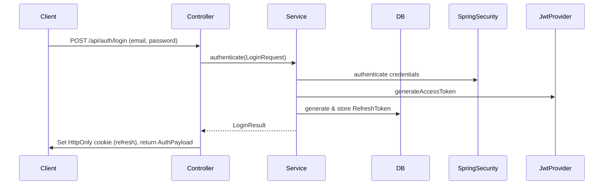
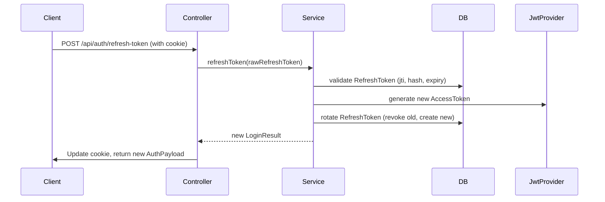
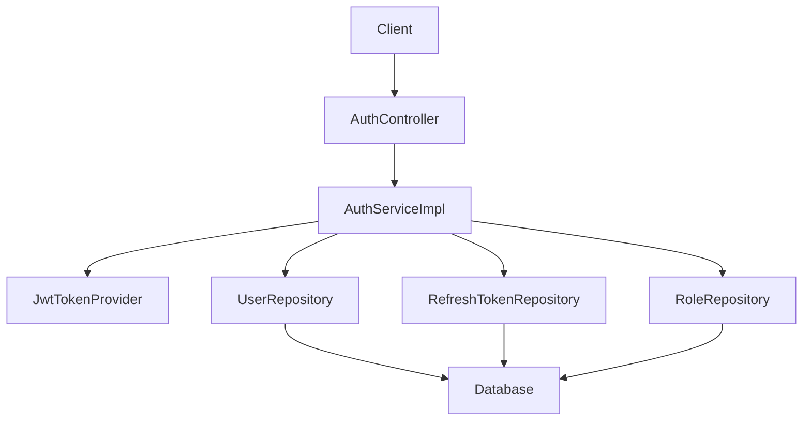

The authentication module follows a layered architecture: Controller → Service → Repository → Entity. It integrates with Spring Security for authentication and JWT for token management.

## Components

- **Controller**: Handles HTTP requests (e.g., `/api/auth/login`).
- **Service**: Business logic for auth operations.
- **Repository**: JPA interfaces for database access.
- **Entities/DTOs**: Data models for users, tokens, requests/responses.

## Key Flows

### Login Flow

### Refresh Token Flow

### Architecture Diagram

