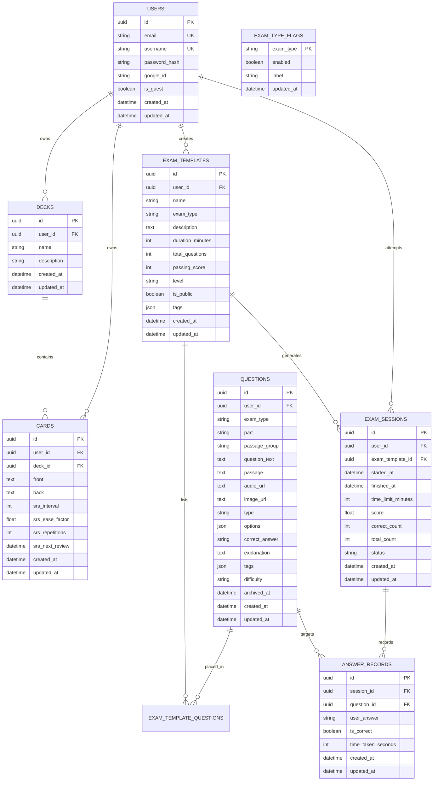

# 🏗️ Architecture & Database Schema

This document details the database model architecture, entity relationships, migration workflows, and schema design for LinguFlow's PostgreSQL database.

---

## 📊 Entity Relationship Diagram (ERD)



> **Note**: `EXAM_TYPE_FLAGS` has no foreign key to `EXAM_TEMPLATES` — it's keyed by
> the `exam_type` string value itself (`"toeic"`, `"hsk"`, ...), not a relational
> reference. A missing row means the type is enabled by default; see
> [Exam-Type Feature Flags](../features/exam-type-feature-flags.md) for the full enforcement model.

---

## 🗄️ Database Tables Specifications

### 1. `users` Table
Stores user accounts (standard email/password, Google OAuth2, and temporary guest accounts).
- `id`: `UUID` (Primary Key, default `gen_random_uuid()`)
- `email`: `VARCHAR(255)` (Unique, Indexed)
- `username`: `VARCHAR(100)` (Unique, Indexed)
- `password_hash`: `VARCHAR(255)` (Bcrypt hashed password, nullable for Google/Guest accounts)
- `google_id`: `VARCHAR(255)` (Unique, Nullable)
- `is_guest`: `BOOLEAN` (Default `False`)
- `created_at` / `updated_at`: `TIMESTAMPTZ`

### 2. `decks` Table
Groups flashcards into custom study decks.
- `id`: `UUID` (Primary Key)
- `user_id`: `UUID` (Foreign Key -> `users.id` ON DELETE CASCADE)
- `name`: `VARCHAR(150)` (Required)
- `description`: `TEXT` (Optional)
- **Aggregation**: `card_count` is dynamically calculated via `Outer Join` on `cards.deck_id`.

### 3. `cards` Table
Stores flashcard pairs with SuperMemo-2 (SM-2) spaced repetition parameters.
- `id`: `UUID` (Primary Key)
- `user_id`: `UUID` (Foreign Key -> `users.id` ON DELETE CASCADE)
- `deck_id`: `UUID` (Foreign Key -> `decks.id` ON DELETE SET NULL, Nullable)
- `front`: `TEXT` (Prompt / word / phrase)
- `back`: `TEXT` (Definition / translation / example)
- `srs_interval`: `INTEGER` (Days until next review, default `0`)
- `srs_ease_factor`: `FLOAT` (Difficulty factor, default `2.5`, floor `1.3`)
- `srs_repetitions`: `INTEGER` (Successful consecutive reviews count, default `0`)
- `srs_next_review`: `TIMESTAMPTZ` (Scheduled review timestamp, default `now()`)

### 4. `exam_templates` Table
Stores certification practice exam templates (built-in public & custom user-created).
- `id`: `UUID` (Primary Key)
- `user_id`: `UUID` (Foreign Key -> `users.id` ON DELETE SET NULL, Nullable for public templates)
- `name`: `VARCHAR(255)` (Exam title)
- `exam_type`: `VARCHAR(50)` (`"toeic"`, `"ielts"`, `"hsk"`, `"jlpt"`, `"custom"`)
- `description`: `TEXT`
- `duration_minutes`: `INTEGER` (Time limit in minutes)
- `total_questions`: `INTEGER` (Total question count)
- `passing_score`: `INTEGER` (Passing threshold percentage, e.g. `60`)
- `level`: `VARCHAR(50)` (`"Intermediate"`, `"Advanced"`, `"N5"`, etc.)
- `is_public`: `BOOLEAN` (Default `False`)
- `tags`: `JSON` (Array of tags)

### 5. `questions` Table
Shared bank items. Placement on an exam is the `exam_template_questions` join
table — a question has **no** `exam_template_id`. Soft-delete via `archived_at`.
- `id`: `UUID` (Primary Key)
- `user_id`: `UUID` (Foreign Key -> `users.id` ON DELETE SET NULL, Nullable; built-ins are `NULL`)
- `exam_type`: `VARCHAR` (Required bank taxonomy: `"toeic"`, `"ielts"`, …)
- `part`: `VARCHAR` (Nullable, normalized e.g. `part1`–`part7`)
- `passage_group`: `VARCHAR` (Nullable; shared passage **or** listening clip)
- `question_text`: `TEXT` (Required prompt)
- `passage`: `TEXT` (Reading text, or optional listening **script**)
- `audio_url` / `image_url`: `TEXT` (Nullable; https URL or R2 key — see [TOEIC Listening Items](../features/toeic-listening.md); added in `0010_question_listening_media`)
- `type`: `VARCHAR(50)` (`"multiple-choice"`)
- `options`: `JSON` (List of choice strings e.g. `["A. ...", "B. ..."]`)
- `correct_answer`: `VARCHAR(10)` (`"A"`, `"B"`, `"C"`, `"D"`)
- `explanation`: `TEXT` (Answer explanation)
- `difficulty`: `VARCHAR(20)` (`"easy"`, `"medium"`, `"hard"`)
- `listed_in_bank`: `BOOLEAN` (Exam-only items stay off bank listings)
- `archived_at`: `TIMESTAMPTZ` (Soft delete; sessions still resolve the row)

Placement is `exam_template_questions` (`exam_template_id`, `question_id`, `order_index`).
Deleting an exam removes **links only**. Listening media lives on the question
row — see [TOEIC Listening Items](../features/toeic-listening.md).

### 6. `exam_sessions` Table
Tracks student exam attempts, elapsed times, and final scores.
- `id`: `UUID` (Primary Key)
- `user_id`: `UUID` (Foreign Key -> `users.id` ON DELETE CASCADE)
- `exam_template_id`: `UUID` (Foreign Key -> `exam_templates.id` ON DELETE CASCADE)
- `started_at`: `TIMESTAMPTZ` (Session start time)
- `finished_at`: `TIMESTAMPTZ` (Session completion time, Nullable)
- `time_limit_minutes`: `INTEGER` (Time limit)
- `score`: `FLOAT` (Percentage score `0.0` - `100.0`)
- `correct_count`: `INTEGER` (Total correct answers)
- `total_count`: `INTEGER` (Total questions)
- `status`: `VARCHAR(20)` (`"in-progress"`, `"completed"`, `"abandoned"`)

### 7. `answer_records` Table
Records candidate answers for each question during an exam session.
- `id`: `UUID` (Primary Key)
- `session_id`: `UUID` (Foreign Key -> `exam_sessions.id` ON DELETE CASCADE)
- `question_id`: `UUID` (Foreign Key -> `questions.id` ON DELETE CASCADE)
- `user_answer`: `VARCHAR(10)` (Selected answer choice e.g. `"B"`)
- `is_correct`: `BOOLEAN` (Result flag)
- `time_taken_seconds`: `INTEGER` (Time spent on question)

### 8. `exam_type_flags` Table
Backend-owned enable/disable switch per exam type — content-readiness gating and an
ops kill switch, added in migration `0006_exam_type_flags`. See
[Exam-Type Feature Flags](../features/exam-type-feature-flags.md) for the full design.
- `exam_type`: `VARCHAR` (Primary Key — `"toeic"`, `"ielts"`, `"hsk"`, `"jlpt"`, ...)
- `enabled`: `BOOLEAN` (Default `true`)
- `label`: `VARCHAR` (Display name, e.g. `"TOEIC"`)
- `updated_at`: `TIMESTAMPTZ`
- A missing row (e.g. for `"custom"`, which is never represented here) means the
  type is enabled — absence is not the same as an explicit disable.

### 9. `feature_flags` Table
Product-wide kill switches (starting with `ai`), added in `0012_feature_flags`.
See [AI Service Layer](../features/ai-service-layer.md).
- `key`: `VARCHAR` (Primary Key — e.g. `"ai"`)
- `enabled`: `BOOLEAN` (Default `true`)
- `updated_at`: `TIMESTAMPTZ`
- A missing row means the feature is **enabled**.

### 10. `ai_explanations` Table
Cache for explain output (`0013_ai_explanations`). Unique `(kind, subject_key, locale)`.
- `kind`: `card` or `exam_answer`
- `subject_key`: card UUID, or `{session_id}:{question_id}`
- `content`, `provider`, `created_at`

### 11. `ai_generation_jobs` Table
Async question-generation jobs (`0014_ai_generation_jobs`).
- `user_id`: owner (CASCADE on user delete)
- `status`: `pending` / `running` / `succeeded` / `failed`
- `payload` / `result` JSON, `error` text (generic, never a vendor dump)

---

## 🛠️ Alembic Database Migration Workflow

Alembic handles version control and schema migrations for PostgreSQL.

```bash
# Generate a new migration script automatically from SQLAlchemy models
alembic revision --autogenerate -m "Add new table"

# Upgrade database to latest schema version
alembic upgrade head

# Downgrade database by 1 migration step
alembic downgrade -1
```
