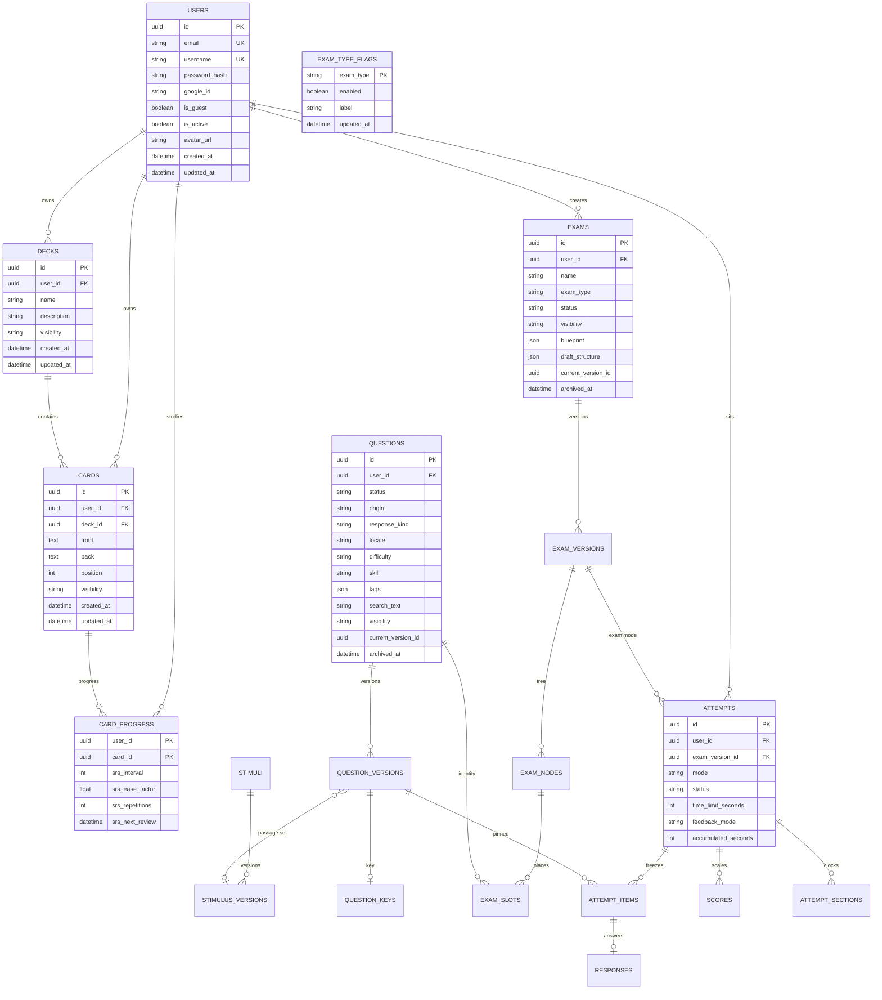

# 🏗️ Architecture & Database Schema

This document details the database model architecture, entity relationships, migration workflows, and schema design for LinguFlow's PostgreSQL database.

**Full column-level reference:** [database-design.md](./database-design.md) (assessment v2, flashcards, sharing).  
**Authoring / sitting lifecycle:** [Question & Exam Design](./question-and-exam-design.md).

---

## 📊 Entity Relationship Diagram (ERD)


```mermaid
erDiagram
    USERS ||--o{ DECKS : owns
    USERS ||--o{ CARDS : owns
    USERS ||--o{ CARD_PROGRESS : studies
    USERS ||--o{ EXAMS : creates
    USERS ||--o{ ATTEMPTS : sits
    DECKS ||--o{ CARDS : contains
    CARDS ||--o{ CARD_PROGRESS : progress

    STIMULI ||--o{ STIMULUS_VERSIONS : versions
    QUESTIONS ||--o{ QUESTION_VERSIONS : versions
    QUESTION_VERSIONS ||--o| QUESTION_KEYS : key
    QUESTION_VERSIONS }o--o| STIMULUS_VERSIONS : "passage set"
    EXAMS ||--o{ EXAM_VERSIONS : versions
    EXAM_VERSIONS ||--o{ EXAM_NODES : tree
    EXAM_NODES ||--o{ EXAM_SLOTS : places
    QUESTIONS ||--o{ EXAM_SLOTS : identity
    EXAM_VERSIONS ||--o{ ATTEMPTS : "exam mode"
    ATTEMPTS ||--o{ ATTEMPT_ITEMS : freezes
    QUESTION_VERSIONS ||--o{ ATTEMPT_ITEMS : pinned
    ATTEMPT_ITEMS ||--o| RESPONSES : answers
    ATTEMPTS ||--o{ SCORES : scales
    ATTEMPTS ||--o{ ATTEMPT_SECTIONS : clocks

    USERS {
        uuid id PK
        string email UK
        string username UK
        string password_hash
        string google_id
        boolean is_guest
        boolean is_active
        string avatar_url
        datetime created_at
        datetime updated_at
    }

    DECKS {
        uuid id PK
        uuid user_id FK
        string name
        string description
        string visibility
        datetime created_at
        datetime updated_at
    }

    CARDS {
        uuid id PK
        uuid user_id FK
        uuid deck_id FK
        text front
        text back
        int position
        string visibility
        datetime created_at
        datetime updated_at
    }

    CARD_PROGRESS {
        uuid user_id PK
        uuid card_id PK
        int srs_interval
        float srs_ease_factor
        int srs_repetitions
        datetime srs_next_review
    }

    QUESTIONS {
        uuid id PK
        uuid user_id FK
        string status
        string origin
        string response_kind
        string locale
        string difficulty
        string skill
        json tags
        string search_text
        string visibility
        uuid current_version_id
        datetime archived_at
    }

    EXAMS {
        uuid id PK
        uuid user_id FK
        string name
        string exam_type
        string status
        string visibility
        json blueprint
        json draft_structure
        uuid current_version_id
        datetime archived_at
    }

    ATTEMPTS {
        uuid id PK
        uuid user_id FK
        uuid exam_version_id FK
        string mode
        string status
        int time_limit_seconds
        string feedback_mode
        int accumulated_seconds
    }

    EXAM_TYPE_FLAGS {
        string exam_type PK
        boolean enabled
        string label
        datetime updated_at
    }
```

> **Note**: Assessment v2 (`0017` / `0018`) replaced `exam_templates`,
> `exam_sessions`, and `answer_records`. SM-2 left `cards` for `card_progress`
> in `0015` (per-learner schedules on shared cards). `EXAM_TYPE_FLAGS` has no FK
> to `exams` — it is keyed by the `exam_type` string (`"toeic"`, `"hsk"`, …). A
> missing row means enabled. See [Exam-Type Feature Flags](../features/exam-type-feature-flags.md)
> and [Question & Exam Design](./question-and-exam-design.md).

---

## 🗄️ Database Tables Specifications

### 1. `users` Table

Stores user accounts (standard email/password, Google OAuth2, and temporary guest accounts).

- `id`: `UUID` (Primary Key)
- `email` / `username`: unique, indexed, nullable
- `password_hash`: nullable for Google / guest accounts
- `google_id`: unique, nullable
- `is_guest`: `BOOLEAN` (default `false`)
- `is_active`: `BOOLEAN` (default `true`; deactivation checked at login — `0007`)
- `daily_streak`, `last_active`, `last_ip`: activity / guest cleanup
- `avatar_url`: R2 object key (`0008`)
- `created_at` / `updated_at`: `TIMESTAMPTZ`

### 2. `decks` Table

Groups flashcards into custom study decks.

- `id`: `UUID` (Primary Key)
- `user_id`: `UUID` → `users.id` ON DELETE CASCADE
- `name`: required
- `description`: optional
- `visibility`: `private` \| `protected` \| `public` (`0015`)
- **Aggregation**: `card_count` is calculated via join on `cards.deck_id` (not a stored column).
- Deleting a deck **ORM-cascades** to its cards even though `cards.deck_id` is `ON DELETE SET NULL` at the column level.

### 3. `cards` Table

Flashcard content and presentation order. **SM-2 state is not stored here.**

- `id`: `UUID` (Primary Key)
- `user_id`: `UUID` → `users.id` ON DELETE CASCADE
- `deck_id`: `UUID` → `decks.id` ON DELETE SET NULL (nullable = Unfiled)
- `front` / `back`: prompt and answer text
- `position`: order within a deck (independent of SRS)
- `image_url` / `notes`: optional
- `visibility`: `private` \| `protected` \| `public` (`0015`)

### 3b. `card_progress` Table

Per-learner SuperMemo-2 schedule (`0015_item_sharing`). Enables studying a shared/public card without writing onto the author's row.

- PK: `(user_id, card_id)` → `users` / `cards` ON DELETE CASCADE
- `srs_interval`, `srs_ease_factor` (default `2.5`, floor `1.3` in the service), `srs_repetitions`
- `srs_next_review`: indexed due date
- `updated_at`

### 4. Assessment v2 tables (`exams`, `questions`, `attempts`, …)

Introduced in `0017_assessment_v2_schema`; legacy v1 tables (and
`ai_generation_jobs`) dropped in `0018_drop_legacy_assessment`. Denormalized bank
search column in `0019_question_search_text`. Runtime columns (`mode`, pause,
`attempt_sections`, `question_notes`) in `0020_attempt_runtime`. Blueprint columns
and `exam_type_blueprints` in `0021_exam_blueprints`. Full design:
[Question & Exam Design](./question-and-exam-design.md) · column lists in
[database-design.md](./database-design.md). Models: `backend/app/models/assessment.py`.

| Table | Role |
| --- | --- |
| `stimuli` / `stimulus_versions` | Shared source material; version content in `body` (DSL) |
| `questions` / `question_versions` / `question_keys` | Bank identity, immutable `body`, answer key (separate table) |
| `ai_provenance` | Prompt/model metadata for AI-authored question versions |
| `exams` / `exam_versions` | Exam identity + published immutable composition |
| `exam_nodes` / `exam_slots` | Recursive section/part tree; slots point at question **identity** |
| `attempts` / `attempt_items` / `responses` | Sitting; pins question/stimulus **versions** (`exam_version_id` nullable for bank practice) |
| `scores` | One row per scale (percent, section, TOEIC total, …) |
| `attempt_sections` | Frozen section locks/clocks per sitting |
| `question_notes` | One learner note per `(user, question)` |
| `exam_type_blueprints` | Optional admin override of the per-type structure gate |

**Question bank browse columns** on `questions` (listing never opens version JSON):
`status` (`draft` \| `in_review` \| `published` \| `retired`), `origin`
(`human` \| `ai` \| `import`), `response_kind`, `locale`, `difficulty`, `skill`,
`tags` (JSONB), `search_text` (from `0019`), `visibility`, `archived_at`.
`GET /api/questions/facets` returns only the vocabularies actually present:
response kinds, difficulties, locales, skills, tags. Bodies and media are **not**
flat columns on `questions` — they live in `question_versions.body` /
`stimulus_versions.body` (DSL; blocks are nested inside that JSON). Soft-delete
via `archived_at`; attempts still resolve archived items.

### 5. `exam_type_flags` Table

Backend-owned enable/disable switch per exam type — content-readiness gating and an
ops kill switch, added in migration `0006_exam_type_flags`. See
[Exam-Type Feature Flags](../features/exam-type-feature-flags.md) for the full design.

- `exam_type`: `VARCHAR` (Primary Key — `"toeic"`, `"ielts"`, `"hsk"`, `"jlpt"`, ...)
- `enabled`: `BOOLEAN` (Default `true`)
- `label`: `VARCHAR` (Display name, e.g. `"TOEIC"`)
- `updated_at`: `TIMESTAMPTZ`
- A missing row (e.g. for `"custom"`, which is never represented here) means the
  type is enabled — absence is not the same as an explicit disable.

### 6. `feature_flags` Table

Product-wide kill switches (starting with `ai`), added in `0012_feature_flags`.
See [AI Service Layer](../features/ai-service-layer.md).

- `key`: `VARCHAR` (Primary Key — e.g. `"ai"`)
- `enabled`: `BOOLEAN` (Default `true`)
- `updated_at`: `TIMESTAMPTZ`
- A missing row means the feature is **enabled**.

### 7. `ai_explanations` Table

Cache for explain output (`0013_ai_explanations`). Unique `(kind, subject_key, locale)`.

- `kind`: `card` or attempt-item explain subjects (see assessment AI router)
- `subject_key`: card UUID, or attempt/item-scoped key
- `content`, `provider`, `created_at`

### 8. Sharing tables (`0015`)

- `item_members`: explicit grantees `(item_type, item_id, user_id)` — used by decks/cards **and** assessment (`question` \| `stimulus` \| `exam`)
- `item_effective_access` / `item_effective_grantees`: materialized projection for **decks/cards** only (assessment v2 reads visibility off the row; no exam→bank inheritance)

> **`ai_generation_jobs` is gone.** Created in `0014`, dropped in `0018` with the
> legacy assessment tables. AI draft provenance lives on `ai_provenance` keyed by
> `question_version_id`.

---

## 🛠️ Alembic Database Migration Workflow

Alembic handles version control and schema migrations for PostgreSQL.
Current head: **`0021_exam_blueprints`**.

```bash
# Generate a new migration script automatically from SQLAlchemy models
alembic revision --autogenerate -m "Add new table"

# Upgrade database to latest schema version
alembic upgrade head

# Downgrade database by 1 migration step
alembic downgrade -1
```

On SQLite local boot, prefer `python run_local.py` (`create_all` + `alembic stamp head`) — do not run `alembic upgrade head` against SQLite.
