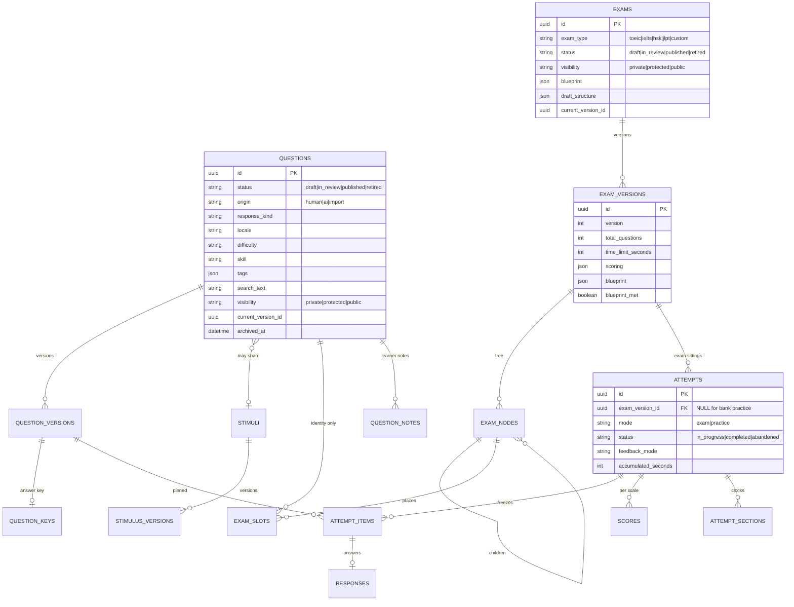

# 📝 Question & Exam Design (Dev)

End-to-end design of the question bank and exam/practice subsystem across
**both halves** of LinguFlow — FastAPI/PostgreSQL backend and Vue 3 frontend.

**Audience:** developers about to change authoring, sitting, grading, practice
draws, or the question bank. Read this before your first change under
`backend/app/routers/assessment_*.py`, `backend/app/services/assessment/`, or
`frontend/src/features/assessment/`.

**Related pages:** [Architecture & database schema](./architecture-and-database-schema.md)
(full ERD, migrations) · [API documentation](./api-documentation.md) ·
[Practice mode](../features/practice-mode.md) ·
[TOEIC listening items](../features/toeic-listening.md) ·
[Exam-type feature flags](../features/exam-type-feature-flags.md)

> **Assessment v2.** Migrations `0017_assessment_v2_schema` +
> `0018_drop_legacy_assessment` replaced the v1 tables
> (`exam_templates`, `exam_sessions`, `answer_records`, flat `questions` bodies).
> Runtime columns landed in `0020_attempt_runtime`; per-type structure gates in
> `0021_exam_blueprints`. Do not reintroduce the legacy model names or
> `/api/exams/templates` / `/api/exams/sessions` routes.

---

## 🧭 The mental model in one paragraph

A **Question** is a shared bank identity; its authored body lives in immutable
**QuestionVersion** rows (answer keys in **QuestionKey**). Shared source material
(passages, photos, audio) lives in **Stimulus** / **StimulusVersion** blocks, not
copied onto every stem. An **Exam** is a stable identity; publish freezes an
**ExamVersion** with a recursive **ExamNode** tree and **ExamSlot** placements
(question _identity_, not version). Sitting creates an **Attempt** that pins
`question_version_id` (and optional `stimulus_version_id`) on each
**AttemptItem**, so editing the bank cannot rewrite finished results. **Practice**
is the same attempt machinery with `mode=practice` (bank or exam-sourced draws,
optional immediate feedback, pause, notes). Results and multi-scale scores live
on **Score** rows, not a single float on the attempt.

---

## 🗃️ Domain model



### Why versions exist

v1 froze _which_ questions were asked (`AnswerRecord.question_id`) but not their
content, so editing a published stem rewrote every finished results page.
v2 pins **versions** on `attempt_items`. Soft-delete (`archived_at`) still
keeps past attempts resolvable; bank listings filter archived rows, attempt
resolution does not.

### Blueprints

`exams.blueprint` is the working standard for the type (or an admin override in
`exam_type_blueprints`, same “missing row = catalog default” idiom as
`exam_type_flags`). On publish, the frozen copy and `blueprint_met` land on
`exam_versions`. Incomplete drafts use `draft_structure` / `draft_saved_at`.

### Practice vs exam

| | Exam attempt | Practice attempt |
| --- | --- | --- |
| Start | `POST /api/attempts` with `examId` | `POST /api/practice/from-exam` or `/from-bank` |
| `exam_version_id` | required (published version) | nullable for bank draws |
| Feedback | typically `none` until finish | may be `immediate` |
| Notes | — | `PUT /api/practice/notes` upserts per question identity |
| Guests | allowed where product rules say so | refused |

Bank draws sample from the **full** matching published set
(`sample_question_ids`), not “newest N then shuffle”.

---

## 🔄 Lifecycle — authoring an exam

1. `POST /api/exams` creates a draft `Exam` (blueprint resolved for `exam_type`).
2. Draft structure is edited via `GET`/`PUT /api/exams/{id}/draft`.
3. Bank items are authored under `/api/questions` (+ stimuli); publish a question
   before it can sit in a published exam.
4. `POST /api/exams/{id}/publish` freezes an `ExamVersion` (nodes, slots,
   scoring, blueprint snapshot).
5. Sitters start from the exam’s `current_version_id`.

---

## 🔄 Lifecycle — sitting

1. `POST /api/attempts` (or a practice start) creates the attempt, freezes
   `attempt_items` (and `attempt_sections` when the tree has timed/locked
   sections), and returns an `AttemptPaperOut`.
2. `PUT /api/attempts/{id}/responses` writes `Response.raw`; grading fills
   `graded` / `points` where machine-scorable.
3. Pause/resume adjust `paused_at` / `resumed_at` / `accumulated_seconds`.
4. `POST /api/attempts/{id}/finish` computes `scores` and marks completed.
5. Results: `GET /api/attempts/{id}/results`. Explain:
   `POST /api/attempts/{id}/items/{position}/explain` — completed attempts, or
   practice mode (in-progress exam explain stays blocked).

---

## 🧱 Backend layering

Keep this shape — do not add DDD folders or repositories.

| Layer | Path | Rule |
| --- | --- | --- |
| Router | `app/routers/assessment_*.py` | HTTP path, Pydantic schema, one service call. **No SQLAlchemy queries.** |
| Service | `app/services/assessment/` | Business logic + queries. `flush()` ok, no `commit()`. |
| Model | `app/models/assessment.py` | SQLAlchemy tables. |
| Schema | `app/schemas/assessment.py` | Request/response with **camelCase aliases** for the Vue app. |
| DSL | `app/domain/dsl/` | Stimulus/question body blocks (text, audio, image, …). |

**Files for this subsystem:**

```txt
app/models/assessment.py          Question, Stimulus, Exam, Attempt, …
app/models/exam_type_flag.py
app/models/exam_type_blueprint.py
app/core/exam_structure_catalog.py
app/core/exam_type_catalog.py
app/core/exam_blueprint.py
app/services/assessment/
  bank.py  exams.py  attempts.py  scoring.py  projections.py
  explain.py  notes.py  access.py  generation.py
app/routers/
  assessment_bank.py
  assessment_exams.py
  assessment_practice.py
  assessment_ai.py
```

`get_db()` remains the sole commit point for HTTP requests. Prefer 404 over 403
when an id must not be confirmed.

---

## 🖼️ Frontend layering

Everything lives under `features/assessment/`. Cross-feature primitives go in
`shared/` — **promote to `shared/` rather than importing across feature
boundaries.**

```txt
features/assessment/
  bank/          QuestionBankView + store
  authoring/     QuestionForm, PassageSetForm, editors
  composer/      ExamComposerView, BlueprintEditor, draft helpers
  runtime/       ExamListView, ExamBriefingView, AttemptView, ResultsView,
                 attemptStore, ExamHud, answer sheet, integrity
  practice/      PracticeSetupView
  components/    BlockList, ResponseInput, block/response views
features/admin/  AdminBlueprintsPanel (per-type blueprint overrides)
```

**Routes:** `/questions` · `/exams` · `/exams/new` · `/exams/:examId/edit` ·
`/exams/:examId/start` · `/practice` · `/attempts/:attemptId` ·
`/attempts/:attemptId/results` · `/admin`

### `attemptStore` — the sitting’s source of truth

Elapsed time is derived from timestamps + `accumulatedSeconds` (pause-aware),
not a naïve per-tick decrement. Section clocks and auto-submit live in one
`recompute` path. Components read store getters; they do not run independent
timers.

---

## 🌐 API surface (summary)

### Question bank — `/api/questions` (+ stimuli)

| Method | Path | Notes |
| --- | --- | --- |
| `GET` | `/questions` | paged bank (`QuestionPageOut`); filters hit columns on `questions`, never version JSON |
| `GET` | `/questions/facets` | present values only: response kinds, difficulties, locales, skills, tags |
| `POST` | `/questions` | create (draft); optional attach to an existing stimulus |
| `GET` `PUT` | `/questions/{id}` | authoring read includes the key (edit permission required) |
| `POST` | `/questions/{id}/publish` | |
| `DELETE` | `/questions/{id}` | soft delete (`archived_at`) |
| `GET` | `/questions/{id}/preview` | readable body **without** answer key |
| `GET` `PUT` | `/questions/{id}/sharing` | |
| `POST` | `/passage-sets` | one stimulus + stems that share it |
| `POST` | `/stimuli` | create stimulus alone |
| `GET` `PUT` `DELETE` | `/stimuli/{id}` | shared source material |
| `GET` | `/stimuli/{id}/questions` | stems on a stimulus |

### Exams & attempts — `/api/exams`, `/api/attempts`

| Method | Path | Notes |
| --- | --- | --- |
| `GET` `POST` | `/exams` | list / create |
| `GET` | `/exams/{id}` | |
| `GET` `PUT` | `/exams/{id}/draft` | working structure |
| `POST` | `/exams/{id}/publish` | freeze version |
| `GET` `PUT` | `/exams/{id}/sharing` | |
| `POST` | `/attempts` | start exam attempt (**403** if type disabled) |
| `GET` | `/attempts`, `/attempts/{id}` | |
| `PUT` | `/attempts/{id}/responses` | |
| `POST` | `/attempts/{id}/pause` · `/resume` · `/finish` | |
| `GET` | `/attempts/{id}/results` | |

### Practice — `/api/practice`

| Method | Path | Notes |
| --- | --- | --- |
| `POST` | `/practice/from-exam` | |
| `POST` | `/practice/from-bank` | uniform sample of matching published items |
| `POST` | `/practice/drills/{id}/resit` | |
| `PUT` | `/practice/notes` | upsert note for a question identity |

### HTTP caching

`GET /api/exam-types` remains publicly cacheable. Do **not** cache in-progress
papers, answer keys, or signed media play URLs.

---

## ⚠️ Contract gotchas

- **Prefer `id`, not `_id`.** Some legacy response helpers still emit both;
  new frontend code must use `id`.
- **Silent `??` fallbacks hide contract drift.** When touching an endpoint a
  component already calls, open the call site and check field names
  (`timeLimitSeconds`, nested paper shapes, etc.).
- **Media is block-shaped.** Audio/image live in stimulus/question DSL blocks,
  not `questions.audio_url` columns (those were v1). Play URLs are resolved for
  the attempt paper, not the raw bank listing.
- **Exam-type kill switch:** listing omits disabled types; starting an attempt
  or practice for a disabled type returns **403**. In-progress/completed
  attempts keep working. See [Exam-Type Feature Flags](../features/exam-type-feature-flags.md).
