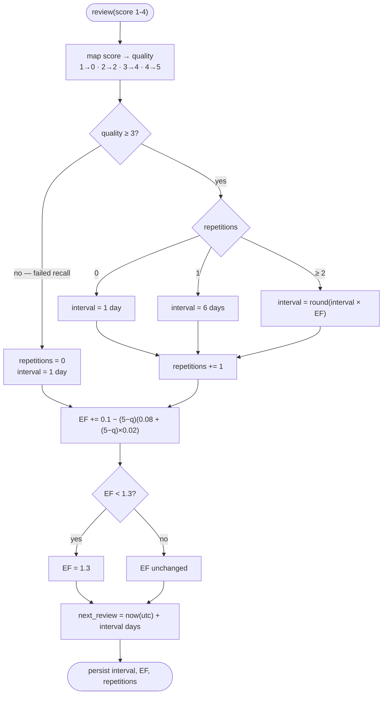

# 🧠 SuperMemo-2 (SM-2) Spaced Repetition Engine

LinguFlow implements a pure Python implementation of the **SuperMemo-2 (SM-2)** spaced repetition algorithm to optimize flashcard retention and study efficiency.

---

## 📐 Mathematical Formulation

When a user reviews a flashcard, they select a score rating between **1** and **4**:

| User Rating | Label | Description | Quality Score ($q$) |
|---|---|---|---|
| **1** | **Blackout** | Complete blackout / incorrect recall | **0** |
| **2** | **Hard** | Correct recall with significant hesitation | **2** |
| **3** | **Good** | Successful recall after slight delay | **4** |
| **4** | **Easy** | Perfect, instantaneous recall | **5** |

---

## 🔄 Algorithm Step-by-Step Calculation



The ease factor is updated on **every** review, including failures — only the
interval and repetition counter reset.

Given the previous state:
- `I_prev`: Previous interval in days
- `EF_prev`: Previous ease factor
- `n_prev`: Previous consecutive success count (repetitions)
- `q`: Quality score (`0, 2, 4, 5`)

### 1. Updating Repetitions (`n`) and Interval (`I`)

If `q < 3` (User rated **Blackout** or failed recall):
- `n_next = 0`
- `I_next = 1` day

If `q >= 3` (User rated **Hard**, **Good**, or **Easy**):
- If `n_prev == 0` $\implies$ `I_next = 1` day
- If `n_prev == 1` $\implies$ `I_next = 6` days
- If `n_prev >= 2` $\implies$ `I_next = round(I_prev * EF_prev)`
- `n_next = n_prev + 1`

### 2. Updating Ease Factor (`EF`)

The Ease Factor (`EF`) measures card intrinsic difficulty. It is updated using the SM-2 quadratic curve:

```text
EF_next = EF_prev + (0.1 - (5 - q) * (0.08 + (5 - q) * 0.02))
```

:::tip Ease Factor Lower Bound
The Ease Factor is bounded by a strict minimum floor of **1.3** to prevent cards from becoming impossible to schedule:
```text
EF_next = max(1.3, EF_next)
```
:::

### 3. Scheduling Next Review Timestamp

The next review date is calculated by adding `I_next` days to the current UTC timestamp:

```text
NextReviewDate = CurrentTime + timedelta(days = I_next)
```

---

## 🐍 Python Implementation (`app/services/sm2_service.py`)

```python
from datetime import datetime, timedelta, timezone
from typing import Dict, Any

SCORE_TO_QUALITY = {
    1: 0,  # Blackout
    2: 2,  # Hard
    3: 4,  # Good
    4: 5,  # Easy
}

def calculate_sm2(
    interval: int,
    ease_factor: float,
    repetitions: int,
    score: int
) -> Dict[str, Any]:
    quality = SCORE_TO_QUALITY.get(score, max(0, min(5, score)))

    if quality < 3:
        repetitions = 0
        interval = 1
    else:
        if repetitions == 0:
            interval = 1
        elif repetitions == 1:
            interval = 6
        else:
            interval = int(round(interval * ease_factor))
        repetitions += 1

    # SM-2 Ease Factor formula
    ease_factor += (0.1 - (5 - quality) * (0.08 + (5 - quality) * 0.02))
    if ease_factor < 1.3:
        ease_factor = 1.3

    next_review = datetime.now(timezone.utc) + timedelta(days=interval)

    return {
        "interval": interval,
        "ease_factor": ease_factor,
        "repetitions": repetitions,
        "next_review_date": next_review,
    }
```

---

## 📊 State Progression Example

| Review # | User Score | Quality $q$ | Interval (Days) | Repetitions | Ease Factor |
|---|---|---|---|---|---|
| Initial | - | - | 0 | 0 | 2.50 |
| **Review 1** | Good (3) | 4 | 1 | 1 | 2.50 |
| **Review 2** | Easy (4) | 5 | 6 | 2 | 2.60 |
| **Review 3** | Good (3) | 4 | 16 ($6 \times 2.6$) | 3 | 2.60 |
| **Review 4** | Blackout (1) | 0 | 1 (Reset) | 0 | 2.12 |
