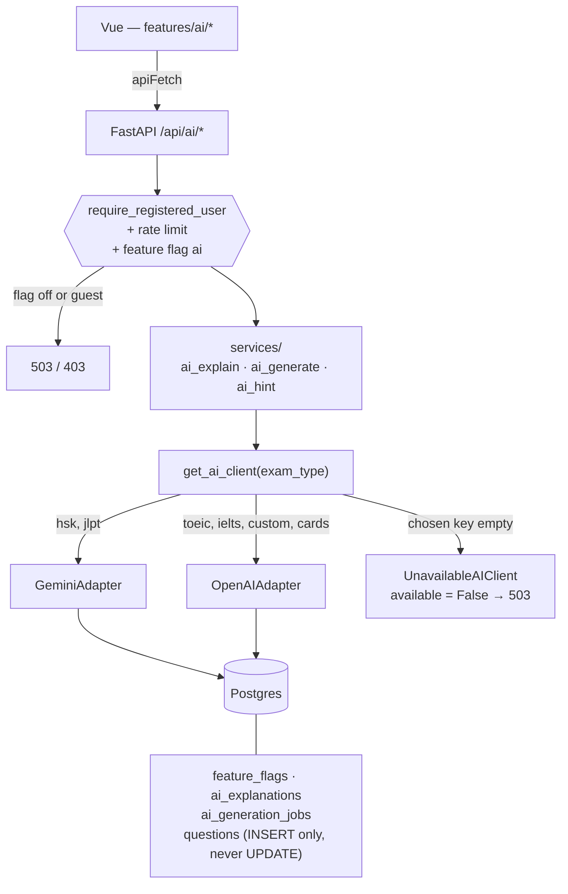
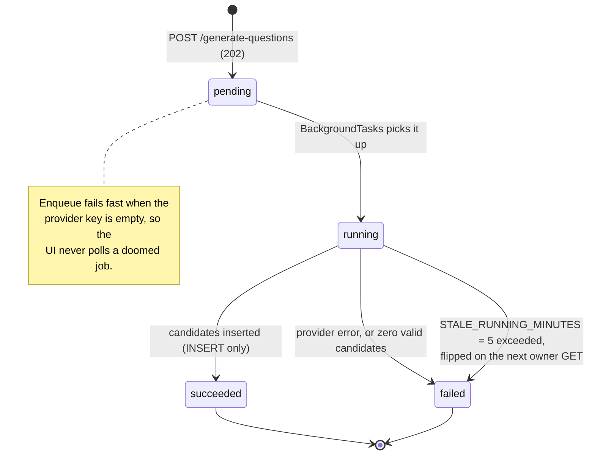

# AI Service Layer (Developer Guide)

Implementation of `AI_FEATURE_GUIDE.md` on branch `feature/ai_generation` ([PR #96](https://github.com/newtc22222/lingu-flow/pull/96)).

Learner-facing copy: [AI Features](./ai-features.md).

---

## Goals

1. One provider-agnostic client — nothing outside `backend/app/services/ai/` imports an LLM SDK or vendor HTTP API.
2. Three product surfaces: explain, async question generate, non-spoiling hint.
3. Fail **closed** (HTTP **503**, generic detail) on missing keys, timeouts, 4xx/5xx from the vendor, or unparseable structured output. Never 500, never a raw vendor message.
4. Core product (cards, SM-2, exam create/answer/finish) must work with empty keys and with the AI kill switch off.
5. Health probes never ping Gemini/OpenAI.

Out of scope: speech/audio, Redis/SQS, embeddings/RAG, auto-attaching generated questions to templates.

---

## Architecture



`get_db()` remains the sole **HTTP** commit point. The generate worker opens its own `AsyncSessionLocal` and commits — same shape as `jobs/cleanup_guests.py`.

---

## Provider routing

`backend/app/core/exam_type_catalog.py`:

| Exam type | Provider | Source |
|---|---|---|
| `hsk`, `jlpt` | Gemini | `CJK_EXAM_TYPES` |
| `toeic`, `ielts`, `custom`, cards | OpenAI | default |

Override with `AI_DEFAULT_PROVIDER=gemini|openai`. Empty override keeps the catalog split.

Factory: `get_ai_client(exam_type=None)` — **never raises at construction**. Empty key → `UnavailableAIClient` (`available is False`). Routes map that to 503 immediately (generate also fails fast on enqueue so the UI does not poll a doomed job).

Adapters talk HTTP via `httpx` (already a backend dep). Timeouts default to `AI_REQUEST_TIMEOUT_SECONDS` (20s). Retries: up to 3 attempts on timeout / 429 / 5xx only.

Logs at info: `provider`, `latency_ms`, `ok`. Never keys, never full user content.

---

## Authz and errors

| Rule | Status |
|---|---|
| Missing/invalid token | 401 (`get_current_user`) |
| Guest | 403 `Registered account required` |
| Kill switch `ai=false` | 503 on every `/api/ai/*` |
| Card not owned / session not owned / job not owned / question not in session `AnswerRecord` | **404** (do not confirm existence) |
| Owner asks explain on an **in-progress** session | **409** |
| Provider down / timeout / malformed / spoiler after retry | **503** `AI features are temporarily unavailable` |
| Rate limit | **429** + `Retry-After` (`SlidingWindowLimiter`) |

Rate limits (keyed by **user id**, not IP):

| Limiter | Budget |
|---|---|
| `ai_explain_limiter` | 20 / 60s |
| `ai_generate_limiter` | 5 / 3600s |
| `ai_hint_limiter` | 10 / 60s |

Do not reuse the auth IP limiters. Tests disable these in `conftest.py` like the login limiters.

Exam invariants (do not work around):

- Template-by-id reads go through `ExamService.readable_template_or_404` (`is_public OR owned`, else 404). Session-owned paths follow `get_session_details` (already scoped).
- Session composition is the frozen `AnswerRecord` set, not the live template.
- Generate **inserts** via `QuestionService.create_question` only. Never `update_question`, never write `exam_template_questions`.
- Do not serialize session questions through a question-ownership-gated builder (seeded questions have `user_id = NULL`). AI responses return `{ explanation }` / `{ hint }` only.

---

## HTTP contract

All `/api/ai/*` bodies/responses use camelCase aliases.

### Feature flags (kill switch)

Same “absence = enabled” semantics as [Exam-Type Feature Flags](./exam-type-feature-flags.md). Dedicated `feature_flags` table — **do not** store `ai` as a fake exam type.

| Method | Path | Auth |
|---|---|---|
| `GET` | `/api/feature-flags` | None (global config) |
| `PATCH` | `/api/feature-flags/{key}` | Root admin |

`GET` example:

```json
[{ "key": "ai", "enabled": true }]
```

`PATCH /api/feature-flags/ai` body: `{ "enabled": false }`. Unknown key → 404.

### Explain

```http
POST /api/ai/explain-card
{ "cardId": "<uuid>", "locale": "en" }

POST /api/ai/explain
{ "sessionId": "<uuid>", "questionId": "<uuid>", "locale": "en" }
```

`200`:

```json
{ "explanation": "...", "cached": false, "provider": "openai" }
```

Cache table `ai_explanations`, unique `(kind, subject_key, locale)`. `kind` is `card` or `exam_answer`. `subject_key` is the card id or `{sessionId}:{questionId}`.

### Generate

```http
POST /api/ai/generate-questions
{ "topic": "...", "examType": "toeic", "count": 5, "difficulty": "medium", "locale": "en" }

202 { "jobId": "<uuid>" }

GET /api/ai/jobs/{jobId}
{ "jobId": "...", "status": "pending|running|succeeded|failed", "result": { "questionIds": [] }, "error": null }
```

`count` 1–10. `examType` in `toeic|ielts|hsk|jlpt|custom`. Worker: `jobs/generate_questions.py` via FastAPI `BackgroundTasks`. Zero valid candidates → `failed`, not `succeeded` + `[]`. A `running` job older than 5 minutes is flipped to `failed` on the next owner `GET`.

Job lifecycle (`AIGenerationJob.status`, `services/ai_generate_service.py`):



### Hint

```http
POST /api/ai/hint
{ "sessionId": "<uuid>", "questionId": "<uuid>" }

200 { "hint": "..." }
```

In-progress + owned + `AnswerRecord` contains the question. Prompt **omits** the key; `hint_leaks_answer()` then rejects letter-as-answer phrasing and the winning option text. One retry, then 503. Does not touch `time_limit_minutes`.

---

## Data model (Alembic)

| Revision | Table |
|---|---|
| `0012_feature_flags` | `feature_flags` (`key` PK, `enabled`, `updated_at`). Seeds `ai=true`. |
| `0013_ai_explanations` | `ai_explanations` + unique `(kind, subject_key, locale)` |
| `0014_ai_generation_jobs` | `ai_generation_jobs` (`user_id` CASCADE, `status`, `payload`, `result`, `error`, timestamps) |

Missing `feature_flags` row ⇒ enabled. Staging/prod: `alembic upgrade head` via existing `entrypoint.sh`.

---

## Frontend

```
frontend/src/features/ai/
  api.ts            # apiFetch wrappers only
  types.ts
  components/
    ExplainPanel.vue
    HintControl.vue
    GenerateQuestionsPanel.vue
```

Mounts: `ExamResultsView`, `ReviewSession` (after flip), `LearnView` (after MCQ select), `QuestionBankView`, `QuestionCard` (`H`). Each control owns local `loading` / `error` refs — no Pinia AI store. Copy under `ai.*` in `en.json` / `vi.json` (`font-body` / `font-label` for Vietnamese).

Admin toggle: `AdminFlagsPanel` → `PATCH /api/feature-flags/ai`.

---

## Environment

| Variable | Default | Notes |
|---|---|---|
| `GEMINI_API_KEY` | `""` | Empty = Gemini unavailable |
| `OPENAI_API_KEY` | `""` | Empty = OpenAI unavailable |
| `AI_DEFAULT_PROVIDER` | `""` | `gemini` / `openai` override |
| `AI_REQUEST_TIMEOUT_SECONDS` | `20` | Per provider call |

No frontend env vars. Secrets stay on Railway.

---

## Operator guide

**Instant disable (no deploy):**

1. Admin Console → Feature Flags → **AI features** → Deactivate, or
2. `PATCH /api/feature-flags/ai` `{ "enabled": false }`, or
3. `UPDATE feature_flags SET enabled = false, updated_at = now() WHERE key = 'ai';`

`/api/health` and `/api/health/ready` stay green during a vendor outage.

**Rollback:** leave the flag off; revert PR #96 if you need the code gone. Cache and job rows are disposable; inserted `questions` are real bank data (existing Postgres backups).

**In-process worker limits:** a process crash can leave a job `running` until the 5-minute stale `GET` marks it failed. Redis/RQ is the documented scale trigger — do not add it until that is measured.

---

## Tests

CI must never call Gemini or OpenAI. Adapters accept a fake `transport`; services patch `get_ai_client`.

| Module | Covers |
|---|---|
| `tests/test_ai_client.py` | Routing, empty key, retry vs 4xx, structured parse |
| `tests/test_feature_flags.py` | Public GET, admin PATCH, missing = enabled |
| `tests/test_ai_explain.py` | Happy, 401, guest 403, non-owner 404, in-progress 409, 503, flag off |
| `tests/test_ai_generate.py` | 202, owner poll, unattached insert, other-user 404, zero-valid → failed |
| `tests/test_ai_hint.py` | Happy, spoiler regression (must not leak `correct_answer`), completed 404, missing AnswerRecord 404 |
| `tests/test_exam_visibility.py` | Re-run after wiring — no authz regressions |

---

## File map

| Area | Path |
|---|---|
| Client | `backend/app/services/ai/` |
| Product services | `backend/app/services/ai_{explain,generate,hint}_service.py` |
| Router | `backend/app/routers/ai.py`, `feature_flags.py` |
| Worker | `backend/app/jobs/generate_questions.py` |
| Frontend | `frontend/src/features/ai/` |
