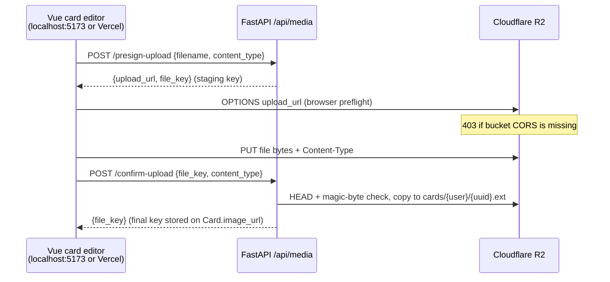

# 🖼️ Card Image Uploads (R2 + CORS)

How flashcard images get from the card editor into **Cloudflare R2**, and the
bucket setting that is easy to miss: **R2 CORS**. FastAPI `CORS_ORIGINS` does
**not** cover this hop — the browser PUTs bytes straight to R2.

Related: [Deployment Guide](../operations/deployment-guide.md) (bucket + tokens),
[API Documentation](../architecture/api-documentation.md) (`/api/media/*`),
[Domain Cutover](../operations/domain-cutover.md) (staging vs production hosts),
[TOEIC Listening Items](./toeic-listening.md) (`purpose: "question"`, audio types).

---

## 🔄 Upload pipeline

Card images never pass through Railway as file bytes. The backend only **signs**
short-lived URLs; the Vue app talks to R2 directly.



Rules that must stay true:

- Object keys are user-scoped: staging `uploads/{user_id}/{uuid}{ext}`, final
  `cards/{user_id}/{uuid}{ext}` when `purpose` is `"card"` (default), or
  `questions/{user_id}/{uuid}{ext}` when `purpose` is `"question"`. The original
  filename never becomes the key.
- Cards: `image/png`, `image/jpeg`, `image/webp` only, **10 MB**. Questions also
  allow `audio/mpeg`, `audio/wav`, `audio/webm`, `audio/mp4` (`.mp3` / `.wav` /
  `.webm` / `.m4a`), **15 MB** for audio. Caps are enforced in the browser
  before PUT; presigned PUT cannot reliably enforce length server-side.
- `Card.image_url` and `Question.audio_url` / `image_url` store the **object
  key** (or an https URL), not a durable public URL. Study / bank previews call
  `GET /api/media/presign-download/{file_key}` for owner keys. Exam sitters use
  session-signed `audioPlayUrl` instead — see [TOEIC Listening Items](./toeic-listening.md).
- Card save must not require a successful R2 round-trip. A failed upload shows
  an inline retry error; the card can still be saved without an image.

Frontend helper: `frontend/src/shared/media.ts` (`uploadImage`,
`uploadQuestionMedia`, `resolveMediaUrl`).
Backend: `backend/app/routers/media.py`, `services/media_service.py`,
`services/storage.py`.

---

## 🔌 API

All three routes require `Authorization: Bearer <token>`.

| Method | Endpoint | Role |
|---|---|---|
| `POST` | `/api/media/presign-upload` | Sign a PUT for a **staging** key |
| `POST` | `/api/media/confirm-upload` | Validate the object, copy to a **final** `cards/…` key |
| `GET` | `/api/media/presign-download/{file_key}` | Sign a GET for a **final** key only |
| `DELETE` | `/api/media/{file_key}` | Delete a staging or unattached final object |

Presign request / response:

```json
// POST /api/media/presign-upload
{ "filename": "photo.png", "content_type": "image/png" }

{ "upload_url": "https://<account>.r2.cloudflarestorage.com/<bucket>/uploads/...", "file_key": "uploads/<userId>/<uuid>.png" }
```

The PUT to `upload_url` must use the **same** `Content-Type` that was signed
(`image/png`, `image/jpeg`, or `image/webp`). Do **not** send the app JWT to R2
— the query string is the authorization.

Download-presign and confirm return **404** (never 403) when the key is not
under the caller’s own prefix. Staging keys cannot be downloaded; only
`cards/{user_id}/…` is signed for GET.

A failed R2 call from the API is a generic **503** (`Media storage is unavailable`).
That is **not** the usual “upload failed in the editor” symptom — see below.

---

## 🔐 Environment (`backend/.env`)

```env
R2_ACCOUNT_ID=
R2_ACCESS_KEY_ID=
R2_SECRET_ACCESS_KEY=
R2_BUCKET_NAME=linguflow-media          # or linguflow-media-staging locally
R2_ENDPOINT_URL=https://<ACCOUNT_ID>.r2.cloudflarestorage.com
```

All five default to empty / `linguflow-media` in `Settings`. The app **boots**
with R2 unset; only media endpoints fail (503), and health checks never ping R2.

`get_settings()` is `@lru_cache()`. Uvicorn `--reload` does **not** re-read
`.env`. After changing any `R2_*` value, **stop and start** the backend.
Otherwise the process keeps signing the previous bucket and access key.

`ListBuckets` **403 AccessDenied** on a scoped Object Read & Write token is
normal. `HeadBucket` + `PutObject` on the named bucket is the real check.

---

## 🚨 Symptom: editor shows “Không thể tải ảnh lên”

Typical UI copy: *Không thể tải ảnh lên. Bạn có thể thử lại hoặc vẫn lưu thẻ.*

Network tab:

| Step | Expected | Broken (this page) |
|---|---|---|
| `POST /api/media/presign-upload` | **200** | 401 / 503 = auth or missing R2 env |
| `OPTIONS` to `*.r2.cloudflarestorage.com` | **200** + `Access-Control-Allow-Origin` | **403** `CORS not configured for this bucket` |
| `PUT` to the signed URL | **200** | `net::ERR_FAILED` (browser blocked the preflight) |
| `POST /api/media/confirm-upload` | **200** | never reached |

Chrome console:

> Access to fetch at `https://<account>.r2.cloudflarestorage.com/…` from origin
> `http://localhost:5173` has been blocked by CORS policy: Response to preflight
> request doesn't pass access control check: No `Access-Control-Allow-Origin`
> header is present on the requested resource.

A **Python** PUT with the same credentials succeeds. That proves the keys work;
only the **browser → R2** hop is blocked.

Railway / FastAPI CORS (`CORS_ORIGINS`, `CORS_ORIGIN_REGEX`) applies to
`/api/*` only. The file never goes through FastAPI.

---

## ✅ Fix: bucket CORS policy

Cloudflare Dashboard → **R2** → the bucket the running process actually signs
for (`R2_BUCKET_NAME`) → **Settings → CORS policy**.

Apply this on **every** bucket the app uses (`linguflow-media`,
`linguflow-media-staging` if you split them):

```json
[
  {
    "AllowedOrigins": [
      "http://localhost:5173",
      "http://127.0.0.1:5173",
      "http://localhost:8080",
      "https://lingu-flow.vercel.app",
      "https://lingu-flow-git-staging-phi-vos-projects.vercel.app"
    ],
    "AllowedMethods": ["GET", "PUT", "HEAD"],
    "AllowedHeaders": ["content-type"],
    "ExposeHeaders": ["ETag"],
    "MaxAgeSeconds": 3600
  }
]
```

Add any other SPA origin you care about (PR preview hosts, `lingu-flow.com`
after [Domain Cutover](../operations/domain-cutover.md)). `AllowedHeaders` must include
`content-type` because the signed PUT sends it and the browser therefore
preflights.

After saving CORS:

1. Restart the backend if you just changed `.env`.
2. Retry the card-editor file picker.
3. Expect: presign **200** → R2 PUT **200** → confirm **200** → image key on the card.
