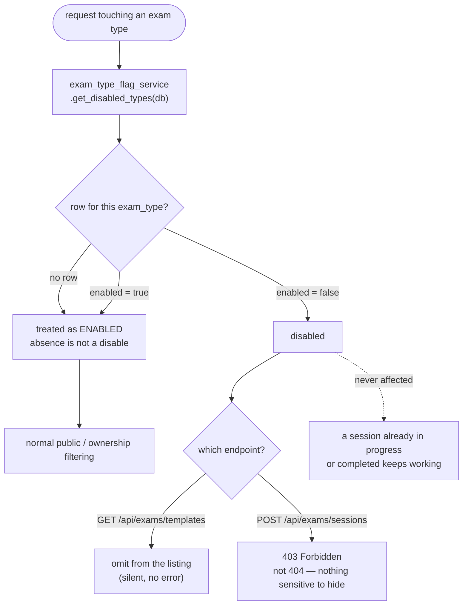

# 🚩 Exam-Type Feature Flags

LinguFlow gates each certification exam type (TOEIC, IELTS, HSK, JLPT, and future
additions like TOEFL or TOPIK) behind a **backend-owned enable/disable flag**. This
gives operators two things without a redeploy: **content-readiness gating** (keep a
newly-seeded exam type hidden until it's verified) and an **ops kill switch** (instantly
hide a broken exam type). It is a global on/off per type, not per-user targeting or
A/B experimentation.

---

## 🗄️ Data Model

A dedicated `exam_type_flags` table, added in migration `0006_exam_type_flags`:

| Column | Type | Notes |
|---|---|---|
| `exam_type` | `VARCHAR` (Primary Key) | `"toeic"`, `"ielts"`, `"hsk"`, `"jlpt"`, ... |
| `enabled` | `BOOLEAN` (default `true`) | |
| `label` | `VARCHAR` | Display name, e.g. `"TOEIC"` |
| `updated_at` | `TIMESTAMPTZ` | |

**Absence means enabled, not disabled.** A type with no row in this table — including
`custom` (user-created exam templates), which is never represented here — is treated
as enabled. Only an explicit `enabled = false` row disables a type. This rule holds
end-to-end: the backend service, the API response, and the frontend catalog all apply
it the same way, so a not-yet-seeded exam type never accidentally disappears.

---

## 🔌 API

| Method | Endpoint | Description | Protected |
|---|---|---|---|
| `GET` | `/api/exam-types` | Enabled/disabled state for every flag-controlled exam type | No |

**Response**:
```json
[
  { "key": "toeic", "enabled": true },
  { "key": "hsk", "enabled": false }
]
```

No auth is required — this is global configuration, not user data, and the exam hub
needs it before a viewer is necessarily logged in.

---

## 🚦 Enforcement



Two existing endpoints in `/api/exams` enforce the flag:

- **`GET /api/exams/templates`** excludes any template whose `exam_type` is disabled,
  in addition to its existing public/ownership filtering.
- **`POST /api/exams/sessions`** returns **403** (not 404) when starting a session
  against a disabled exam type. 403 rather than 404 is deliberate: unlike a private
  template, there's nothing sensitive to hide about a type being temporarily
  unavailable.

**A session already in progress or completed is never affected.** Disabling a type
only blocks *new* sessions and hides it from listings — answering questions, viewing
results, and finishing an already-started session on a since-disabled type all keep
working normally. This mirrors the existing invariant that session results resolve
from the session's own `AnswerRecord`s, not the live state of the template or its
exam type.

---

## 🖥️ Frontend

- `frontend/src/shared/examTypes.ts` — `EXAM_TYPE_CATALOG`, the single canonical list
  of known exam-type keys, plus `filterEnabledCatalog()`, a pure function that
  intersects the catalog with the backend's enabled/disabled response.
- `frontend/src/shared/store/examTypeFlagsStore.ts` — a Pinia store that fetches
  `GET /api/exam-types` once (`ensureLoaded()`) and exposes the result as
  `enabledTypes`. On a failed fetch it falls back to treating every type as enabled,
  so a broken flags endpoint never takes down exam browsing entirely.

The exam hub, exam composer, and question bank (filters and the question form) all
read from this one store instead of hardcoding the exam-type list — adding a new
exam type no longer means hunting down multiple hardcoded arrays.

---

## 🛠️ Operator Guide

There is no admin UI for toggling flags by design — it's a direct database write:

```sql
-- Disable an exam type (kill switch)
UPDATE exam_type_flags SET enabled = false, updated_at = now() WHERE exam_type = 'hsk';

-- Re-enable it
UPDATE exam_type_flags SET enabled = true, updated_at = now() WHERE exam_type = 'hsk';
```

**Launching a brand-new exam type** (e.g. TOEFL):

1. Add its seed content under `backend/app/seed/data/` (see `toeic_reading.py` for
   the pattern), with `exam_type="toefl"`.
2. Insert a row with `enabled = false`:
   ```sql
   INSERT INTO exam_type_flags (exam_type, enabled, label, updated_at)
   VALUES ('toefl', false, 'TOEFL', now());
   ```
3. Add one entry to `EXAM_TYPE_CATALOG` on the frontend.
4. Verify the seeded content in a local/staging environment — a disabled type is
   invisible to everyone, with no bypass, so verification happens where you control
   the flag directly rather than in production.
5. Flip `enabled = true` in production. No redeploy, no new components.

---

## 🚧 Why Not Vercel Feature Flags?

LinguFlow's frontend is a static Vite SPA on Vercel that only rewrites `/api/*` to
the Railway backend — there's no Vercel-side server component in the request path to
evaluate flags against, which is the actual value proposition of Vercel's flag
tooling. The backend also has to be the enforcement authority regardless (the API
must reject a disabled type even if the UI is bypassed), so a backend-owned table
avoids maintaining a second, redundant source of truth across two platforms.
