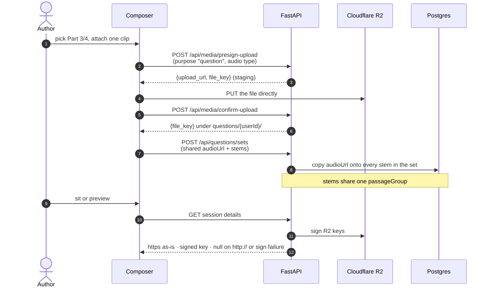

# 🎧 TOEIC Listening Items

How LinguFlow stores, authors, and plays **TOEIC Listening** media (Parts 1–4).
Reading parts (5–7) leave audio and photo empty.

Shipped in **[v1.1.1](../releases/release-v1.1.1.md)** (PR #97). Migration
`0010_question_listening_media` revises `0009_exam_draft_snapshot`.
AI generate (#87) and TTS (#88) are not in this release.

Related: [Card Image Uploads](./card-image-uploads.md) (same R2 presign pipeline),
[API Documentation](../architecture/api-documentation.md),
[Architecture & Database Schema](../architecture/architecture-and-database-schema.md).

---

## 🎯 What this is

Questions stay in the **shared bank**. Listening does **not** add a separate
clip table. Each question may hold:

| Column | Stores |
|---|---|
| `audio_url` | Absolute **https** URL, or an R2 object key (`questions/{user}/{uuid}.ext`) |
| `image_url` | Same dual-mode, photos only (Part 1) |
| `part` | Normalized `part1`–`part7` |
| `passage_group` | Shared id for a conversation / talk / reading set |
| `passage` | Optional **script** (listening) or reading text (Parts 6–7) |

Bank listings omit play URLs. A **live or completed session** may include
short-lived `audioPlayUrl` / `imagePlayUrl` so sitters never need an owner
presign.

---

## 🧩 Part conventions (TOEIC)

| Part | Form | Required media | Shared how |
|---|---|---|---|
| **1** Photos | Single question | Audio + photo | — |
| **2** Question–Response | Single question | Audio | — |
| **3** Conversations | Passage **set** (2+ stems) | One audio on **every** stem | Same `passageGroup` + same audio key |
| **4** Talks | Passage **set** (2+ stems) | One audio on every stem | Same as Part 3 |
| **5** Incomplete sentences | Single question | None | — |
| **6** Text completion | Passage set | None | Shared `passage` + `passageGroup` |
| **7** Reading | Passage set | None | Shared documents joined into `passage` |

The API does **not** require media by part (drafts and later TTS can stay
empty). The **bank compose UI** does: TOEIC Parts 1–4 cannot save without
audio; Part 1 also requires a photo.

---

## ✍️ Authoring (question bank + composer)

- New TOEIC items default to **Part 1**. The compose part select has no
  “Any part” option. Scan filters still offer Any so you can list the whole bank.
- Changing the single form to a **set part** (3, 4, 6, 7) switches to
  **Create passage set** with that part selected. Changing a set to a solo
  part (1, 2, 5) switches back.
- Parts 1–2 use the single form. Parts 3–4 use the set form: required audio
  once, optional script, then stems. `POST /api/questions/sets` copies
  `audioUrl` onto every created stem.
- Removing an uploaded clip or photo opens a **confirm** dialog first.
- Preview uses the same tape transport (`ListeningDeck`) as the exam, with
  **seek** and **no autoplay**.

Frontend: `QuestionForm.vue`, `PassageSetForm.vue`,
`frontend/src/shared/examStructure.ts` (`EXAM_STRUCTURES`, `isListeningPart()`,
`isSetPart()`) and `frontend/src/shared/listening.ts` (`listeningDeckKey()`).
Backend mirror: `app/core/exam_structure_catalog.py`.

---

## 🧪 Sitting, preview, and results

| Surface | Autoplay | Seek |
|---|---|---|
| Live exam (`ExamView` / `QuestionCard`) | Yes (clip starts when the item mounts) | No |
| Composer step 3 preview | No | Yes |
| Results replay | No | Yes |
| Bank / set authoring preview | No | Yes |

Parts 3–4 reuse one deck for the whole `passageGroup` so changing stem does
not restart the clip. Leaving an **in-progress** session (route change or
tab close) shows a warning; saved drafts are not deleted on leave.

Built-in seeded Part 1 items may have no R2 objects — the player shows
“Audio unavailable” / “IMAGE UNAVAILABLE” rather than failing the sit.

---

## 📦 Media contract

Same presign → browser PUT → confirm flow as cards. Pass
`purpose: "question"` so the final key is under `questions/`, not `cards/`.



| | Card | Question |
|---|---|---|
| `purpose` | `"card"` (default) | `"question"` |
| Final prefix | `cards/{userId}/{uuid}.ext` | `questions/{userId}/{uuid}.ext` |
| Types | PNG / JPEG / WebP | Those images **plus** MP3 / WAV / WEBM / M4A |
| Size (browser) | 10 MB images | 10 MB images, **15 MB** audio |

Persisted URLs must be **https** or a key (no scheme). `http://` is **422**.
Session play resolution returns `https://…` as-is, signs R2 keys, and
returns `null` for `http://` or a sign failure (the sit still loads).

Once a question has a **submitted** answer (`AnswerRecord.user_answer != ""`),
options, the correct answer, and media keys are **frozen** (409). Wording,
script (`passage`), tags, and difficulty stay editable.

`DELETE /api/media/{file_key}` refuses a key still referenced by a card **or**
a question.

---

## 🔌 API (listening-specific)

Question create / update / set bodies accept camelCase `audioUrl` and
`imageUrl`. Set create also accepts a shared `audioUrl` (copied to each stem)
and may omit passage/documents when audio is present.

Session details (`GET /api/exams/sessions/{id}/details`) add:

```json
{
  "audioUrl": "questions/<userId>/<uuid>.mp3",
  "imageUrl": "questions/<userId>/<uuid>.jpg",
  "audioPlayUrl": "https://…signed…",
  "imagePlayUrl": "https://…signed…"
}
```

`audioPlayUrl` is session-scoped (the sitter already owns the session). Do
**not** switch session serialization to a question-ownership gate — built-in
items have `user_id = NULL` and would lose their play URL and answer key.

Media:

```json
// POST /api/media/presign-upload
{ "filename": "clip.mp3", "contentType": "audio/mpeg", "purpose": "question" }
```

CORS, bucket policy, and `.env` reload rules are identical to
[Card Image Uploads](./card-image-uploads.md). Audio PUTs also send `Content-Type`,
so the bucket must allow that header.

---

## 🚫 Out of scope (this feature)

- Official 200-item TOEIC seed with real R2 clips
- TTS / generated audio
- A first-class Passage / Clip entity (sets stay a `passageGroup` marker)
- Redis, CDN invalidation, or an upload queue
