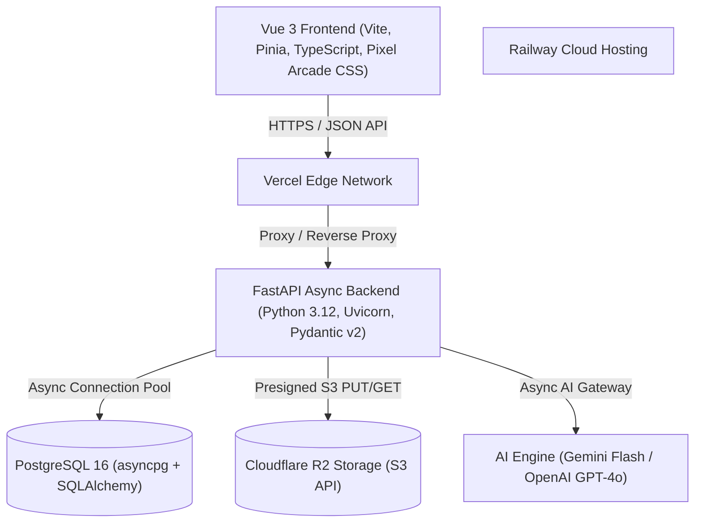

# 🧠 LinguFlow Wiki

Welcome to the **LinguFlow** official technical documentation and architecture hub.

LinguFlow is a modern, high-performance, keyboard-driven language certification platform designed for HSK, JLPT, TOEIC, and IELTS candidates. It combines a distraction-free Vue 3 pixel-art arcade interface with an async Python FastAPI backend, PostgreSQL relational database, SuperMemo-2 (SM-2) spaced repetition engine, and multi-provider AI assistance (Gemini Flash & GPT-4o).

---

## 📚 Documentation Directory

### Start here

| Document | Description |
| --- | --- |
| [**Application Overview**](./overview/application-overview.md) | What LinguFlow is, the feature set, technology stack, and repository layout. |
| [**Architecture & Database Schema**](./architecture/architecture-and-database-schema.md) | Layered architecture, ER diagrams, PostgreSQL models, Alembic migrations, and database design. |
| [**Database Design & Schema**](./architecture/database-design.md) | Detailed table structures, field definitions, indexes, constraints, and cascade behaviors. |
| [**API Documentation**](./architecture/api-documentation.md) | OpenAPI-oriented docs for Auth, Flashcards, Decks, Exams, Question Bank, and Media. |
| [**Spaced Repetition (SM-2)**](./architecture/spaced-repetition-sm2.md) | Deep dive into the SM-2 mathematical model, quality mapping, ease factor bounds, and review queues. |

### Features

| Document | Description |
| --- | --- |
| [**AI Features (User Guide)**](./features/ai-features.md) | How to use explain, question generate, and non-spoiling exam hints. |
| [**AI Service Layer (Dev)**](./features/ai-service-layer.md) | Provider-agnostic client, `/api/ai/*` contracts, kill switch, migrations, and operator guide. |
| [**Exam-Type Feature Flags**](./features/exam-type-feature-flags.md) | Backend-owned enable/disable flags per exam type — content-readiness gating, kill switch, data model, and operator guide. |
| [**TOEIC Listening Items**](./features/toeic-listening.md) | Parts 1–4 audio/photo on the shared bank, set-level clips, session play URLs, and the tape player. |
| [**Card Image Uploads (R2 + CORS)**](./features/card-image-uploads.md) | Presign → browser PUT → confirm pipeline, required **bucket** CORS, and `.env` reload caveats. |

### Operations

| Document | Description |
| --- | --- |
| [**Deployment & DevOps Guide**](./operations/deployment-guide.md) | Deployment blueprints for Vercel (Frontend), Railway (FastAPI + PostgreSQL), Cloudflare R2, and Docker Compose. |
| [**Deployment Plan (Phase 1)**](./operations/deployment-plan.md) | Target infrastructure, platform setup steps, env-var matrix, and the deployment verification checklist. |
| [**Domain Cutover**](./operations/domain-cutover.md) | Staging preview (no custom domain) and the later move of production to `lingu-flow.com`. |

### Improvement Plans

| Document | Description |
|---|---|
| [**Improvement Plans Overview**](./improvement-plans/index.md) | Comprehensive engineering improvement plans, diagnostic scoring, and prioritized backlog. |

### Releases

| Document | Date | Summary |
| --- | --- | --- |
| [**Release v1.2.1**](./releases/release-v1.2.1.md) | 2026-08-08 | **Current official release** — three-theme system and the OMR answer sheet. |
| [**Release v1.2.0**](./releases/release-v1.2.0.md) | 2026-08-07 | Multi-exam-type foundation: five new item types, IELTS registered, single-source version. |
| [**Release v1.1.1**](./releases/release-v1.1.1.md) | 2026-08-06 | TOEIC Listening (bank media + player) and exam-integrity sitting lock. |
| [**Release v1.0.0**](./releases/release-v1.0.0.md) | 2026-08-05 | Horizon A/B features, security, ops, and branding (MVP title removed). |
| [**Release Notes (v0.1.0)**](./releases/release-v0.1.0.md) | 2026-08-05 | Earlier FastAPI + PostgreSQL platform milestone. |

---

## 🛠️ Technology Stack Overview

### 1. Frontend Architecture

- **Framework**: Vue 3 (Composition API `<script setup>`), TypeScript, Pinia State Management, Vue Router 4.
- **Design System**: Arcade Pixel Art CSS design system (`arcade.css`), `Press Start 2P`, `IBM Plex Mono`, and `IBM Plex Sans` typography.
- **Key Views**: `AuthView.vue`, `FlashcardsView.vue`, `DeckManagementView.vue`, `CardManagementView.vue`, `ExamHub.vue`, `ExamCreator.vue`, `ExamResults.vue`.

### 2. Backend Architecture

- **Framework**: FastAPI (Python 3.12+), Pydantic v2 schemas, `uvicorn` ASGI server.
- **ORM & Database**: SQLAlchemy 2.0 (Async Engine) with `asyncpg` driver for PostgreSQL 16.
- **Security & Auth**: `bcrypt` password hashing, `python-jose` JWT authentication, Google OAuth2, in-place guest account migration.
- **Real-Time Streaming**: `sse-starlette` Server-Sent Events (SSE) progress engine.

---

## 🚀 Key Features

> **Key Features at a Glance**:
>
> - **SM-2 Spaced Repetition**: Dynamic card scheduling based on user memory retention scores (1-4).
> - **Full Exam Simulator**: Timed certification practice sets with question passages, multiple-choice options, instant scoring, and detailed review maps. TOEIC Listening (Parts 1–4) plays from the same bank — see [TOEIC Listening Items](./features/toeic-listening.md).
> - **In-Place Guest Account Migration**: Guest users can register at any time without losing a single flashcard or study deck.
> - **33 Built-in Practice Questions**: Pre-seeded exams for TOEIC Part 5, IELTS Academic Reading, HSK Level 2, and JLPT N5.
> - **Optional AI tutor**: Explain cards/results, generate unattached bank questions, non-spoiling in-exam hints — core flows never depend on a vendor. See [AI Features](./features/ai-features.md).
