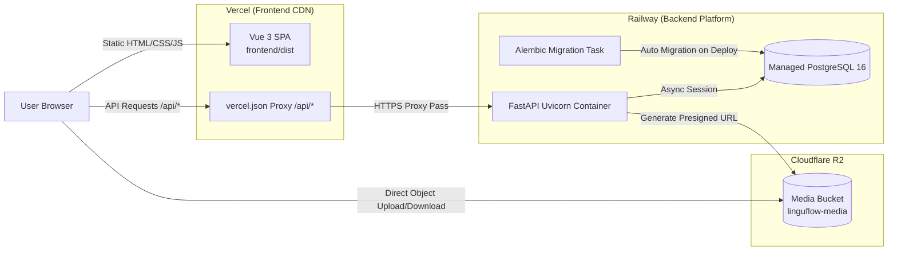

# Deployment Plan: LinguFlow (Phase 1)

This document outlines the production deployment strategy for **LinguFlow**, migrating from obsolete monolithic Express/MongoDB assumptions to a decoupled multi-cloud architecture.

---

## 🎯 Target Infrastructure



| Component | Target Platform | Hosting Model |
| :--- | :--- | :--- |
| **Frontend** | **Vercel** | Static SPA (`frontend/dist`) with serverless HTTP proxy rules |
| **Backend** | **Railway** | Python 3.12 Docker Container running Uvicorn |
| **Database** | **Railway** | Managed PostgreSQL 16 database instance |
| **Object Storage** | **Cloudflare R2** | S3-compatible media storage (`aioboto3` presigned URLs) |

---

## 📋 Step-by-Step Platform Setup

### 1. Cloudflare R2 Media Storage
1. Open Cloudflare Dashboard > **R2**.
2. Create bucket named `linguflow-media`.
3. Under **Manage API Tokens**, generate a token with **Object Read & Write** permissions scoped to `linguflow-media`.
4. Note credentials:
   - Access Key ID
   - Secret Access Key
   - Endpoint URL (`https://<ACCOUNT_ID>.r2.cloudflarestorage.com`)

### 2. Railway Backend & Postgres
1. Create a project in Railway and add a **PostgreSQL** database plugin.
2. Add a service connecting to GitHub repo `newtc22222/lingu-flow`:
   - Set **Root Directory** to `backend`.
   - Set **Builder** to `Dockerfile`.
3. Set **Start Command**:
   ```bash
   alembic upgrade head && uvicorn app.main:app --host 0.0.0.0 --port ${PORT:-8000}
   ```
4. Generate a public Railway domain URL under **Settings > Networking** (e.g. `https://linguflow-backend-production.up.railway.app`).

### 3. Vercel Frontend SPA
1. Import `newtc22222/lingu-flow` repo in Vercel.
2. Configure settings:
   - **Root Directory**: `frontend`
   - **Framework Preset**: `Vite`
   - **Build Command**: `npm run build`
   - **Output Directory**: `dist`
3. Configure `frontend/vercel.json` rewrites to proxy `/api/*` requests to your Railway domain.

---

## 🔐 Environment Variables Matrix

| Platform | Variable Name | Required | Description |
| :--- | :--- | :---: | :--- |
| **Vercel** | *(None)* | No | Managed via `frontend/vercel.json` proxy rewrites |
| **Railway** | `DATABASE_URL` | **Yes** | Auto-injected by Railway Postgres (`${{Postgres.DATABASE_URL}}`) |
| **Railway** | `ENVIRONMENT` | **Yes** | Set to `production` |
| **Railway** | `PORT` | **Yes** | Injected by Railway (`${{PORT}}`) |
| **Railway** | `JWT_SECRET` | **Yes** | 64-char random hex string (`openssl rand -hex 32`) |
| **Railway** | `JWT_ALGORITHM` | **Yes** | `HS256` |
| **Railway** | `CORS_ORIGINS` | **Yes** | `["https://linguflow.vercel.app","http://localhost:5173"]` |
| **Railway** | `CORS_ORIGIN_REGEX` | **Yes** | `https://linguflow-.*\.vercel\.app` |
| **Railway** | `R2_ACCOUNT_ID` | **Yes** | Cloudflare Account ID |
| **Railway** | `R2_ACCESS_KEY_ID` | **Yes** | Cloudflare R2 Access Key ID |
| **Railway** | `R2_SECRET_ACCESS_KEY` | **Yes** | Cloudflare R2 Secret Access Key |
| **Railway** | `R2_BUCKET_NAME` | **Yes** | `linguflow-media` |
| **Railway** | `R2_ENDPOINT_URL` | **Yes** | `https://<ACCOUNT_ID>.r2.cloudflarestorage.com` |

---

## 🔄 CI/CD & Deployment Triggers

- **Frontend (Vercel)**:
  - Pushes to `main` trigger production deployments.
  - Pull Requests generate Vercel preview environments automatically.
  - CORS regex allows preview domains (`https://linguflow-.*\.vercel\.app`) to communicate seamlessly with the backend.

- **Backend (Railway)**:
  - Pushes to `main` trigger container rebuilds.
  - Executed start command automatically runs `alembic upgrade head` prior to starting Uvicorn, guaranteeing schema safety on every deployment.

---

## ✅ Deployment Verification Checklist

- [ ] `GET /api/health` returns `200 OK` from Railway backend.
- [ ] `POST /api/media/presign-upload` returns valid presigned upload URL.
- [ ] Vercel SPA loads root route `/` and routes `/auth`, `/library` without asset 404s.
- [ ] CORS headers allow requests from production Vercel domain and preview subdomains.
