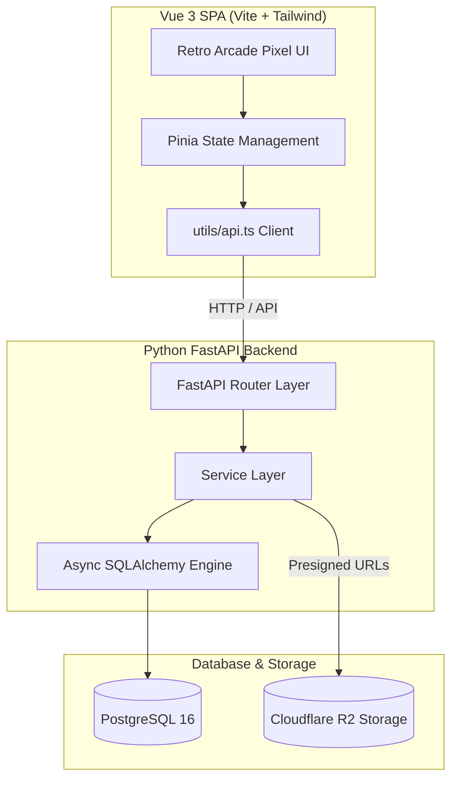

# Application Overview: LinguFlow

**LinguFlow** is a modern, keyboard-driven language learning platform designed for high-efficiency study and certification exam simulation.

---

## 🌟 Key Features

1. **Spaced Repetition System (SRS)**:
   - Powered by an optimized implementation of the **SuperMemo-2 (SM-2)** algorithm.
   - Custom card scheduling based on review ratings (Again, Hard, Good, Easy), target interval multipliers, and ease factors.

2. **Exam Simulator**:
   - Realistic exam simulator supporting major international language certifications: **TOEIC**, **IELTS**, **HSK**, and **JLPT**.
   - Timed test sessions, interactive section navigation, score calculation, and performance analytics.
   - TOEIC Listening (Parts 1–4): shared-bank audio/photo, set-level clips, tape player. See [TOEIC Listening Items](../features/toeic-listening.md).

3. **Deck & Card Management**:
   - Rich Markdown support for card prompt text and answer explanations (`MarkdownRenderer`).
   - Media upload support (audio clips and flashcard images) powered by object storage.

4. **Optional AI tutor** (registered users):
   - Explain a flipped flashcard or a **completed** exam answer.
   - Generate new bank questions from a topic (async job; never auto-attached to an exam).
   - Request an opt-in, non-spoiling hint during a live sitting (`H`).
   - See [AI Features](../features/ai-features.md) and [AI Service Layer](../features/ai-service-layer.md).

5. **Retro-Arcade Pixel Design System**:
   - Unique distraction-free aesthetic with custom pixel framing (`PixelFrame`), IBM Plex typography, and 8-color arcade palette tokens.
   - Pure CSS custom properties integrated into Tailwind utilities.

---

## 🏗️ Technology Stack



| Layer | Technologies |
| :--- | :--- |
| **Frontend** | Vue 3 (Composition API `<script setup>`), TypeScript, Vite, TailwindCSS, Pinia, Marked, DOMPurify |
| **Backend** | Python 3.12, FastAPI, Uvicorn, Pydantic Settings v2, Python-Jose (JWT), Passlib (bcrypt) |
| **Database** | PostgreSQL 16, AsyncPG, SQLAlchemy 2.0 (Asyncio), Alembic Migrations |
| **Storage** | Cloudflare R2 (S3-compatible object storage via `aioboto3`) |

---

## 📁 Repository Structure

```text
lingu-flow/
├── backend/                  # Python FastAPI Backend
│   ├── alembic/              # Database migration scripts
│   ├── app/
│   │   ├── core/             # Auth & security primitives
│   │   ├── models/           # SQLAlchemy Declarative Models
│   │   ├── routers/          # FastAPI API Endpoints (auth, cards, exams, ai, health, media)
│   │   ├── schemas/          # Pydantic Request/Response validation schemas
│   │   ├── services/         # Business logic, AI client (`services/ai/`), R2 helper
│   │   ├── config.py         # Application settings (env validation)
│   │   ├── database.py       # Async engine & session lifecycle
│   │   └── main.py           # FastAPI application entry point & CORS
│   └── tests/                # Pytest async test suite
├── frontend/                 # Vue 3 Frontend
│   ├── src/
│   │   ├── features/         # Domain-driven feature modules (auth, dashboard, exam, flashcards, library, ai)
│   │   ├── shared/           # Reusable UI primitives (PixelFrame, MarkdownRenderer, etc.)
│   │   ├── styles/           # CSS design tokens & Tailwind imports
│   │   └── utils/            # API client wrapper (`apiFetch`)
│   └── vercel.json           # Vercel SPA proxy & rewrite configuration
└── docker-compose.yml        # Local multi-container development environment
```

---

## 🚀 Running Locally

### Option A: Docker Compose (Recommended)
```bash
docker-compose up --build
```
- **Frontend**: http://localhost:8080
- **Backend API Docs**: http://localhost:8000/docs
- **PostgreSQL**: localhost:5432

### Option B: Manual Startup

1. **Backend**:
   ```bash
   cd backend
   python -m venv venv
   .\venv\Scripts\Activate.ps1   # Windows
   pip install -r requirements.txt
   alembic upgrade head
   python -m uvicorn app.main:app --port 8000 --reload
   ```

2. **Frontend**:
   ```bash
   cd frontend
   npm install
   npm run dev
   ```
